Test Markdown File
# Page 1

User’s Guide

4113114-07

---

# Page 2

Copyright and Trademarks

No part of this publication may be reproduced, stored in a retrieval system, or transmitted in any form or by any 
means, electronic, mechanical, photocopying, recording, or otherwise, without the prior written permission of Seiko 
Epson Corporation. No patent liability is assumed with respect to the use of the information contained herein. While 
every precaution has been taken in the preparation of this book, Seiko Epson Corporation assumes no 
responsibility for errors or omissions. Neither is any liability assumed for damages resulting from the use of the 
information contained herein.

Neither Seiko Epson Corporation nor its affiliates shall be liable to the purchaser of this product or third parties for 
damages, losses, costs, or expenses incurred by purchaser or third parties as a result of: accident, misuse, or 
abuse of this product or unauthorized modifications, repairs, or alterations to this product, or (excluding the U.S.) 
failure to strictly comply with Seiko Epson Corporation’s operating and maintenance instructions.

Seiko Epson Corporation shall not be liable against any damages or problems arising from the use of any options 
or any consumable products other than those designated as Original Epson Products or Epson Approved Products 
by Seiko Epson Corporation.

EPSON is a registered trademark of Seiko Epson Corporation in Japan and other countries/regions.

Microsoft, Windows, Windows Vista, and Windows Server are registered trademarks of Microsoft Corporation in 
the United States and/or other countries.

General Notice: Other product names used herein are for identification purposes only and may be trademarks of 
their respective owners. Epson disclaims any and all rights in those marks.

NOTICE: The contents of this manual are subject to change without notice.

Copyright © 2008 Seiko Epson Corporation. All rights reserved.

Copyright and Trademarks
2

---

# Page 3

Contents

Copyright and Trademarks

Important Notice and Safety Instructions

Important Note. . . . . . . . . . . . . . . . . . . . . . . . . . . . . . . . . . . . . . . . . . . . . . . . . . . . . . . . . . . . . 7
Important Safety Instructions. . . . . . . . . . . . . . . . . . . . . . . . . . . . . . . . . . . . . . . . . . . . . . . . . . 7
Setting up the Product . . . . . . . . . . . . . . . . . . . . . . . . . . . . . . . . . . . . . . . . . . . . . . . . . . . 7
Choosing a Place for the Product  . . . . . . . . . . . . . . . . . . . . . . . . . . . . . . . . . . . . . . . . . . 8
Using the Product  . . . . . . . . . . . . . . . . . . . . . . . . . . . . . . . . . . . . . . . . . . . . . . . . . . . . . . 9
Handling Ink Cartridges . . . . . . . . . . . . . . . . . . . . . . . . . . . . . . . . . . . . . . . . . . . . . . . . . . 9
Notice for CD/DVD Discs. . . . . . . . . . . . . . . . . . . . . . . . . . . . . . . . . . . . . . . . . . . . . . . . 10
Concerning Incidental Loss Arising out of Use of this Product  . . . . . . . . . . . . . . . . . . . 11
About Usage Limitation . . . . . . . . . . . . . . . . . . . . . . . . . . . . . . . . . . . . . . . . . . . . . . . . . 11
WARNING . . . . . . . . . . . . . . . . . . . . . . . . . . . . . . . . . . . . . . . . . . . . . . . . . . . . . . . . . . . 11
FCC Compliance Statement For American Users . . . . . . . . . . . . . . . . . . . . . . . . . . . . . 12
For Canadian Users. . . . . . . . . . . . . . . . . . . . . . . . . . . . . . . . . . . . . . . . . . . . . . . . . . . . 12
Indication of the manufacturer and the importer in accordance 
with requirements of directive 2011/65/EU (RoHS) . . . . . . . . . . . . . . . . . . . . . . . . . . 13
Warnings, Cautions, and Notes . . . . . . . . . . . . . . . . . . . . . . . . . . . . . . . . . . . . . . . . . . . 14

Chapter 1  Using Your Software

System Requirements . . . . . . . . . . . . . . . . . . . . . . . . . . . . . . . . . . . . . . . . . . . . . . . . . . . . . . 15
Using the Product  . . . . . . . . . . . . . . . . . . . . . . . . . . . . . . . . . . . . . . . . . . . . . . . . . . . . . 15
Setting a Working Folder and Log . . . . . . . . . . . . . . . . . . . . . . . . . . . . . . . . . . . . . . . . . . . . . 17
Adding the Product  . . . . . . . . . . . . . . . . . . . . . . . . . . . . . . . . . . . . . . . . . . . . . . . . . . . . . . . . 18
Setting for Notification of Job Completion . . . . . . . . . . . . . . . . . . . . . . . . . . . . . . . . . . . . . . . 19
Overview of Applications . . . . . . . . . . . . . . . . . . . . . . . . . . . . . . . . . . . . . . . . . . . . . . . . . . . . 20
EPSON Total Disc Maker  . . . . . . . . . . . . . . . . . . . . . . . . . . . . . . . . . . . . . . . . . . . . . . . 20
EPSON Total Disc Monitor  . . . . . . . . . . . . . . . . . . . . . . . . . . . . . . . . . . . . . . . . . . . . . . 20
EPSON Total Disc Setup. . . . . . . . . . . . . . . . . . . . . . . . . . . . . . . . . . . . . . . . . . . . . . . . 20
Using EPSON Total Disc Maker . . . . . . . . . . . . . . . . . . . . . . . . . . . . . . . . . . . . . . . . . . . . . . 20
Starting EPSON Total Disc Maker. . . . . . . . . . . . . . . . . . . . . . . . . . . . . . . . . . . . . . . . . 20
Getting Information through Online Help . . . . . . . . . . . . . . . . . . . . . . . . . . . . . . . . . . . . 21
Overview of Printer Driver . . . . . . . . . . . . . . . . . . . . . . . . . . . . . . . . . . . . . . . . . . . . . . . . . . . 21
Accessing the Printer Driver  . . . . . . . . . . . . . . . . . . . . . . . . . . . . . . . . . . . . . . . . . . . . . 21
Getting Information through Online Help . . . . . . . . . . . . . . . . . . . . . . . . . . . . . . . . . . . . 22
Uninstalling Software. . . . . . . . . . . . . . . . . . . . . . . . . . . . . . . . . . . . . . . . . . . . . . . . . . . . . . . 23

Contents
3

---

# Page 4

Chapter 2  Publishing Discs

Introduction . . . . . . . . . . . . . . . . . . . . . . . . . . . . . . . . . . . . . . . . . . . . . . . . . . . . . . . . . . . . . . 24
Turning Power On/off. . . . . . . . . . . . . . . . . . . . . . . . . . . . . . . . . . . . . . . . . . . . . . . . . . . 24
Overview of Publish Modes . . . . . . . . . . . . . . . . . . . . . . . . . . . . . . . . . . . . . . . . . . . . . . 25
Drive Settings. . . . . . . . . . . . . . . . . . . . . . . . . . . . . . . . . . . . . . . . . . . . . . . . . . . . . . . . . 26
Printer Settings  . . . . . . . . . . . . . . . . . . . . . . . . . . . . . . . . . . . . . . . . . . . . . . . . . . . . . . . 26
Notice for CD/DVD Writing and Printing  . . . . . . . . . . . . . . . . . . . . . . . . . . . . . . . . . . . . 27
Error Discs . . . . . . . . . . . . . . . . . . . . . . . . . . . . . . . . . . . . . . . . . . . . . . . . . . . . . . . . . . . 29
Precautions for Duplicating CDs/DVDs . . . . . . . . . . . . . . . . . . . . . . . . . . . . . . . . . . . . . 29
Printing on CDs/DVDs with a Commercially Available Software Package  . . . . . . . . . . 30
Notice for Barcode Printing . . . . . . . . . . . . . . . . . . . . . . . . . . . . . . . . . . . . . . . . . . . . . . 30
Standard Mode  . . . . . . . . . . . . . . . . . . . . . . . . . . . . . . . . . . . . . . . . . . . . . . . . . . . . . . . . . . . 31
Loading Discs  . . . . . . . . . . . . . . . . . . . . . . . . . . . . . . . . . . . . . . . . . . . . . . . . . . . . . . . . 31
Accessing EPSON Total Disc Maker. . . . . . . . . . . . . . . . . . . . . . . . . . . . . . . . . . . . . . . 34
Registering Data  . . . . . . . . . . . . . . . . . . . . . . . . . . . . . . . . . . . . . . . . . . . . . . . . . . . . . . 34
Creating Labels . . . . . . . . . . . . . . . . . . . . . . . . . . . . . . . . . . . . . . . . . . . . . . . . . . . . . . . 37
Making the Stacker Settings  . . . . . . . . . . . . . . . . . . . . . . . . . . . . . . . . . . . . . . . . . . . . . 40
Publishing Discs. . . . . . . . . . . . . . . . . . . . . . . . . . . . . . . . . . . . . . . . . . . . . . . . . . . . . . . 42
External Output Mode . . . . . . . . . . . . . . . . . . . . . . . . . . . . . . . . . . . . . . . . . . . . . . . . . . . . . . 44
Loading Discs  . . . . . . . . . . . . . . . . . . . . . . . . . . . . . . . . . . . . . . . . . . . . . . . . . . . . . . . . 44
Accessing EPSON Total Disc Maker. . . . . . . . . . . . . . . . . . . . . . . . . . . . . . . . . . . . . . . 48
Registering Data  . . . . . . . . . . . . . . . . . . . . . . . . . . . . . . . . . . . . . . . . . . . . . . . . . . . . . . 48
Creating Labels . . . . . . . . . . . . . . . . . . . . . . . . . . . . . . . . . . . . . . . . . . . . . . . . . . . . . . . 51
Making the Stacker Settings  . . . . . . . . . . . . . . . . . . . . . . . . . . . . . . . . . . . . . . . . . . . . . 54
Publishing Discs. . . . . . . . . . . . . . . . . . . . . . . . . . . . . . . . . . . . . . . . . . . . . . . . . . . . . . . 56
Batch Mode . . . . . . . . . . . . . . . . . . . . . . . . . . . . . . . . . . . . . . . . . . . . . . . . . . . . . . . . . . . . . . 58
Loading Discs  . . . . . . . . . . . . . . . . . . . . . . . . . . . . . . . . . . . . . . . . . . . . . . . . . . . . . . . . 58
Accessing EPSON Total Disc Maker. . . . . . . . . . . . . . . . . . . . . . . . . . . . . . . . . . . . . . . 62
Registering Data  . . . . . . . . . . . . . . . . . . . . . . . . . . . . . . . . . . . . . . . . . . . . . . . . . . . . . . 63
Creating Labels . . . . . . . . . . . . . . . . . . . . . . . . . . . . . . . . . . . . . . . . . . . . . . . . . . . . . . . 65
Making the Stacker Settings  . . . . . . . . . . . . . . . . . . . . . . . . . . . . . . . . . . . . . . . . . . . . . 68
Publishing Discs. . . . . . . . . . . . . . . . . . . . . . . . . . . . . . . . . . . . . . . . . . . . . . . . . . . . . . . 70
Taking Out Discs . . . . . . . . . . . . . . . . . . . . . . . . . . . . . . . . . . . . . . . . . . . . . . . . . . . . . . . . . . 72
Pausing Publishing  . . . . . . . . . . . . . . . . . . . . . . . . . . . . . . . . . . . . . . . . . . . . . . . . . . . . . . . . 74
Resuming Publishing. . . . . . . . . . . . . . . . . . . . . . . . . . . . . . . . . . . . . . . . . . . . . . . . . . . . . . . 75
Canceling Publishing . . . . . . . . . . . . . . . . . . . . . . . . . . . . . . . . . . . . . . . . . . . . . . . . . . . . . . . 76
Priority Publishing . . . . . . . . . . . . . . . . . . . . . . . . . . . . . . . . . . . . . . . . . . . . . . . . . . . . . . . . . 77

Chapter 3  Replacing Ink Cartridges

Checking the Ink Cartridge Status. . . . . . . . . . . . . . . . . . . . . . . . . . . . . . . . . . . . . . . . . . . . . 78
Precautions on Ink Cartridge Replacement. . . . . . . . . . . . . . . . . . . . . . . . . . . . . . . . . . . . . . 79
Replacing an Ink Cartridge  . . . . . . . . . . . . . . . . . . . . . . . . . . . . . . . . . . . . . . . . . . . . . . . . . . 80

Contents
4

---

# Page 5

Chapter 4  Maintaining Your Product

Checking the Print Head Nozzles . . . . . . . . . . . . . . . . . . . . . . . . . . . . . . . . . . . . . . . . . . . . . 84
Using the Nozzle Check Utility. . . . . . . . . . . . . . . . . . . . . . . . . . . . . . . . . . . . . . . . . . . . 84
Cleaning the Print Head. . . . . . . . . . . . . . . . . . . . . . . . . . . . . . . . . . . . . . . . . . . . . . . . . . . . . 85
Using the Head Cleaning Utility . . . . . . . . . . . . . . . . . . . . . . . . . . . . . . . . . . . . . . . . . . . 86
Using the Product Buttons . . . . . . . . . . . . . . . . . . . . . . . . . . . . . . . . . . . . . . . . . . . . . . . 87
Aligning the Print Head . . . . . . . . . . . . . . . . . . . . . . . . . . . . . . . . . . . . . . . . . . . . . . . . . . . . . 87
Using the Print Head Alignment Utility. . . . . . . . . . . . . . . . . . . . . . . . . . . . . . . . . . . . . . 87
Correcting the Printing Position . . . . . . . . . . . . . . . . . . . . . . . . . . . . . . . . . . . . . . . . . . . . . . . 88
Using the Correcting the Printing Position Utility . . . . . . . . . . . . . . . . . . . . . . . . . . . . . . 88
Cleaning Your Product. . . . . . . . . . . . . . . . . . . . . . . . . . . . . . . . . . . . . . . . . . . . . . . . . . . . . . 89
Cleaning the Exterior of the Product . . . . . . . . . . . . . . . . . . . . . . . . . . . . . . . . . . . . . . . 89
Cleaning the Interior of the Product . . . . . . . . . . . . . . . . . . . . . . . . . . . . . . . . . . . . . . . . 89
Cleaning the Filter . . . . . . . . . . . . . . . . . . . . . . . . . . . . . . . . . . . . . . . . . . . . . . . . . . . . . 90
Getting Maintenance Information. . . . . . . . . . . . . . . . . . . . . . . . . . . . . . . . . . . . . . . . . . . . . . 91
Transporting Your Product. . . . . . . . . . . . . . . . . . . . . . . . . . . . . . . . . . . . . . . . . . . . . . . . . . . 92

Chapter 5  Troubleshooting

Diagnosing the Problem  . . . . . . . . . . . . . . . . . . . . . . . . . . . . . . . . . . . . . . . . . . . . . . . . . . . . 93
Error Indicators  . . . . . . . . . . . . . . . . . . . . . . . . . . . . . . . . . . . . . . . . . . . . . . . . . . . . . . . 93
EPSON Total Disc Monitor  . . . . . . . . . . . . . . . . . . . . . . . . . . . . . . . . . . . . . . . . . . . . . 100
Checking Product Status . . . . . . . . . . . . . . . . . . . . . . . . . . . . . . . . . . . . . . . . . . . . . . . . . . . 100
Using EPSON Total Disc Monitor  . . . . . . . . . . . . . . . . . . . . . . . . . . . . . . . . . . . . . . . . 100
Disc or the Disc Tray Does Not Feed Correctly. . . . . . . . . . . . . . . . . . . . . . . . . . . . . . . . . . 102
Disc Does Not Feed. . . . . . . . . . . . . . . . . . . . . . . . . . . . . . . . . . . . . . . . . . . . . . . . . . . 102
Multiple Disc Feeds . . . . . . . . . . . . . . . . . . . . . . . . . . . . . . . . . . . . . . . . . . . . . . . . . . . 103
Disc Jams  . . . . . . . . . . . . . . . . . . . . . . . . . . . . . . . . . . . . . . . . . . . . . . . . . . . . . . . . . . 103
Writing Problem . . . . . . . . . . . . . . . . . . . . . . . . . . . . . . . . . . . . . . . . . . . . . . . . . . . . . . . . . . 104
Cannot Write to the Disc . . . . . . . . . . . . . . . . . . . . . . . . . . . . . . . . . . . . . . . . . . . . . . . 104
Print Quality Problems. . . . . . . . . . . . . . . . . . . . . . . . . . . . . . . . . . . . . . . . . . . . . . . . . . . . . 105
Horizontal Banding. . . . . . . . . . . . . . . . . . . . . . . . . . . . . . . . . . . . . . . . . . . . . . . . . . . . 105
Vertical Misalignment. . . . . . . . . . . . . . . . . . . . . . . . . . . . . . . . . . . . . . . . . . . . . . . . . . 106
Banding . . . . . . . . . . . . . . . . . . . . . . . . . . . . . . . . . . . . . . . . . . . . . . . . . . . . . . . . . . . . 106
Incorrect or Missing Colors  . . . . . . . . . . . . . . . . . . . . . . . . . . . . . . . . . . . . . . . . . . . . . 106
Blurry or Smeared Printout  . . . . . . . . . . . . . . . . . . . . . . . . . . . . . . . . . . . . . . . . . . . . . 107
Miscellaneous Printout Problems  . . . . . . . . . . . . . . . . . . . . . . . . . . . . . . . . . . . . . . . . . . . . 107
Incorrect or Garbled Characters  . . . . . . . . . . . . . . . . . . . . . . . . . . . . . . . . . . . . . . . . . 107
Incorrect Margins . . . . . . . . . . . . . . . . . . . . . . . . . . . . . . . . . . . . . . . . . . . . . . . . . . . . . 108
Printout Has a Slight Slant. . . . . . . . . . . . . . . . . . . . . . . . . . . . . . . . . . . . . . . . . . . . . . 108
Printed Side is Smeared or Scuffed. . . . . . . . . . . . . . . . . . . . . . . . . . . . . . . . . . . . . . . 108
Printing is too Slow  . . . . . . . . . . . . . . . . . . . . . . . . . . . . . . . . . . . . . . . . . . . . . . . . . . . 108
Ink Adheres to the Recording Surface. . . . . . . . . . . . . . . . . . . . . . . . . . . . . . . . . . . . . 109

Contents
5

---

# Page 6

The Product Does Not Function  . . . . . . . . . . . . . . . . . . . . . . . . . . . . . . . . . . . . . . . . . . . . . 109
All Lights Are Off . . . . . . . . . . . . . . . . . . . . . . . . . . . . . . . . . . . . . . . . . . . . . . . . . . . . . 109
Lights Came On and then Went Out . . . . . . . . . . . . . . . . . . . . . . . . . . . . . . . . . . . . . . 109
Only the Power Light is On  . . . . . . . . . . . . . . . . . . . . . . . . . . . . . . . . . . . . . . . . . . . . . 110
The Ink Light is Flashing or is On after you Replace the Cartridge . . . . . . . . . . . . . . . 110
Software Cannot be Installed. . . . . . . . . . . . . . . . . . . . . . . . . . . . . . . . . . . . . . . . . . . . 110
Ink Pad Nearly Full Message is Displayed by the Software. . . . . . . . . . . . . . . . . . . . . 111
Disc Cannot be Published . . . . . . . . . . . . . . . . . . . . . . . . . . . . . . . . . . . . . . . . . . . . . . 111
Disc Information Cannot be Read . . . . . . . . . . . . . . . . . . . . . . . . . . . . . . . . . . . . . . . . 111
DVD Drive of the Product is not Displayed when You Click "Safely 
Remove Hardware" Icon . . . . . . . . . . . . . . . . . . . . . . . . . . . . . . . . . . . . . . . . . . . . . 111

Appendix A  Where To Get Help

Contacting Customer Support . . . . . . . . . . . . . . . . . . . . . . . . . . . . . . . . . . . . . . . . . . . . . . . 112
Before Contacting Epson. . . . . . . . . . . . . . . . . . . . . . . . . . . . . . . . . . . . . . . . . . . . . . . 112
Help for Users in the United States and Canada. . . . . . . . . . . . . . . . . . . . . . . . . . . . . 112
Help for Users in the Europe (EMEA) . . . . . . . . . . . . . . . . . . . . . . . . . . . . . . . . . . . . . 113
Help for Users in Australia . . . . . . . . . . . . . . . . . . . . . . . . . . . . . . . . . . . . . . . . . . . . . . 113
Help for User’s in Southeast Asia  . . . . . . . . . . . . . . . . . . . . . . . . . . . . . . . . . . . . . . . . 113

Appendix B  Product Information

Product Parts and Control Panel Functions. . . . . . . . . . . . . . . . . . . . . . . . . . . . . . . . . . . . . 115
Product Parts . . . . . . . . . . . . . . . . . . . . . . . . . . . . . . . . . . . . . . . . . . . . . . . . . . . . . . . . 115
Control Panel . . . . . . . . . . . . . . . . . . . . . . . . . . . . . . . . . . . . . . . . . . . . . . . . . . . . . . . . 118
Ink and Disc. . . . . . . . . . . . . . . . . . . . . . . . . . . . . . . . . . . . . . . . . . . . . . . . . . . . . . . . . . . . . 119
Ink Cartridges. . . . . . . . . . . . . . . . . . . . . . . . . . . . . . . . . . . . . . . . . . . . . . . . . . . . . . . . 119
Discs  . . . . . . . . . . . . . . . . . . . . . . . . . . . . . . . . . . . . . . . . . . . . . . . . . . . . . . . . . . . . . . 119
Technical Specifications  . . . . . . . . . . . . . . . . . . . . . . . . . . . . . . . . . . . . . . . . . . . . . . . . . . . 120
Discs  . . . . . . . . . . . . . . . . . . . . . . . . . . . . . . . . . . . . . . . . . . . . . . . . . . . . . . . . . . . . . . 120
Ink Cartridges. . . . . . . . . . . . . . . . . . . . . . . . . . . . . . . . . . . . . . . . . . . . . . . . . . . . . . . . 123
Job Processing  . . . . . . . . . . . . . . . . . . . . . . . . . . . . . . . . . . . . . . . . . . . . . . . . . . . . . . 125
Number of Products that can be Connected to One Computer . . . . . . . . . . . . . . . . . . 125
Printing. . . . . . . . . . . . . . . . . . . . . . . . . . . . . . . . . . . . . . . . . . . . . . . . . . . . . . . . . . . . . 125
Write Speed . . . . . . . . . . . . . . . . . . . . . . . . . . . . . . . . . . . . . . . . . . . . . . . . . . . . . . . . . 126
Mechanical. . . . . . . . . . . . . . . . . . . . . . . . . . . . . . . . . . . . . . . . . . . . . . . . . . . . . . . . . . 126
Electrical  . . . . . . . . . . . . . . . . . . . . . . . . . . . . . . . . . . . . . . . . . . . . . . . . . . . . . . . . . . . 126
Environmental . . . . . . . . . . . . . . . . . . . . . . . . . . . . . . . . . . . . . . . . . . . . . . . . . . . . . . . 127
Standards and Approvals. . . . . . . . . . . . . . . . . . . . . . . . . . . . . . . . . . . . . . . . . . . . . . . 127
Interface. . . . . . . . . . . . . . . . . . . . . . . . . . . . . . . . . . . . . . . . . . . . . . . . . . . . . . . . . . . . 127
Lifetime  . . . . . . . . . . . . . . . . . . . . . . . . . . . . . . . . . . . . . . . . . . . . . . . . . . . . . . . . . . . . 128

Contents
6

---

# Page 7

Important Notice and Safety Instructions

Important Note

You may use the software to operate the EPSON PP-100. You may use the EPSON 
PP-100 to copy materials onto media, including but not limited to CDs and DVDs. You 
agree to respect the rights of copyright owners. EPSON shall have no liability for, and you 
shall hold EPSON harmless from, any copyright infringement by you or your employees, 
representatives, or agents.

Important Safety Instructions

Read all the instructions in this section before using the product. Also, be sure to follow all 
warnings and instructions marked on the product.

Setting up the Product

Observe the following when setting up the product:

❏ Do not block or cover the vents and openings in the product.

❏ Use only the type of power source indicated on the product’s label.

❏ Use only the power cord that comes with the product. Use of another cord may result in 
fire or electric shock.

❏ The product’s power cord is for use with this product only. Use with other equipment 
may result in fire or electric shock.

❏ Be sure the AC power cord meets the relevant local safety standard.

❏ For safety reasons, make sure to ground the power cord.

❏ Avoid using outlets on the same circuit as photocopiers or air control systems that 
regularly switch on and off.

❏ Avoid electrical outlets controlled by wall switches or automatic timers.

❏ Keep the entire computer system away from potential sources of electromagnetic 
interference, such as loudspeakers or the base units of cordless telephones.

Important Notice and Safety Instructions
7

---

# Page 8

❏ Do not use a damaged or frayed power cord.

❏ If you use an extension cord with the product, make sure that the total ampere rating of 
the devices plugged into the extension cord does not exceed the cord’s ampere rating. 
Also, make sure that the total ampere rating of all devices plugged into the wall outlet 
does not exceed the wall outlet’s ampere rating.

❏ Do not attempt to service the product yourself.

❏ Unplug the product and refer servicing to qualified service personnel under the 
following conditions:
The power cord or plug is damaged; liquid has entered the product; the product has 
been dropped or the casing is damaged; the product does not operate normally or 
exhibits a distinct change in performance.

❏ If you plan to use the product in Germany, the building installation must be protected by 
a 10 or 16 amp circuit breaker to provide adequate short-circuit protection and 
over-current protection for the product.

❏ When connecting the product to a computer or other device with a cable, ensure the 
correct orientation of the connectors. Each connector has only one correct orientation. 
Inserting a connector in the wrong orientation may damage both devices connected by 
the cable.

❏ If damage occurs to the plug, replace the cord set or consult a qualified electrician. If 
there are fuses in the plug, make sure you replace them with fuses of the correct size 
and rating.

❏ Commercially available replacement drives do not function on this product.

Choosing a Place for the Product

Observe the following when choosing a place for the product:

❏ Place the product on a flat, stable surface that extends beyond the base of the product 
in all directions. If you place the product by the wall, leave more than 10 cm (3.94") 
between the back of the product and the wall. The product will not operate properly if it 
is tilted at an angle.

❏ Leave enough space in front of the product for the disc cover to be fully opened.

❏ Avoid places subject to rapid changes in temperature and humidity. Also, keep the 
product away from direct sunlight, strong light, or heat sources.

❏ Avoid places subject to dust, shocks, vibrations, or cigarette smoke.

❏ Leave enough room around the product to allow for sufficient ventilation.

Important Notice and Safety Instructions
8

---

# Page 9

❏ Place the product near a wall outlet where the plug can be easily unplugged.

Using the Product

Observe the following when using the product:

❏ Do not insert objects in the product.

❏ Take care not to spill liquid on the product.

❏ Do not use aerosol products that contain flammable gases inside or around this 
product. Doing so may cause fire.

❏ Always turn the product off using the P power button. When this button is pressed, the 
 power light flashes. Do not unplug the product or turn off the power to the outlet 
until the 
 power light stops flashing.

❏ Leave the ink cartridges installed. Removing the cartridges can dry out the print head 
and may prevent the product from printing.

❏ Be careful not to trap your fingers when closing the disc cover.

❏ The product uses galvanized sheet metal, and this may cause rusting at the edges; 
however, this does not cause any harm to the function of the product.

❏ Do not place any drink or liquid on the product as penetration by liquid inside the 
product will cause a malfunction.

❏ Do not open disc cover while running a job (busy indicator is flashing), unless the 
application instructs you to add or remove discs. This may affect write quality or print 
quality. Also, for safety reasons, do not put your hands inside the product while 
beeping, as arm is still moving.

❏ The product cannot be used as a shared printer using the Windows sharing setting.

Handling Ink Cartridges

Observe the following when handling the ink cartridges:

❏ Keep ink cartridges out of the reach of children. Do not allow children to drink from or 
handle the cartridges.

❏ Do not shake ink cartridges; this can cause leakage.

Important Notice and Safety Instructions
9

---

# Page 10

❏ Be careful when you handle used ink cartridges, as there may be some ink remaining 
around the ink supply port. If ink gets on your skin, wash the area thoroughly with soap 
and water. If ink gets into your eyes, flush them immediately with water. If discomfort or 
vision problems remain after a thorough flushing, see a doctor immediately.

❏ Do not remove or tear the label on the cartridge; this can cause leakage.

❏ Install the ink cartridge immediately after you remove it from its package. If you leave a 
cartridge unpacked for a long time before using it, normal printing may not be possible.

❏ Use the ink cartridge before the expiration date printed on its package.

❏ Do not dismantle ink cartridges or try to refill them. This could damage the print head.

❏ After bringing an ink cartridge inside from a cold storage site, allow it to warm up at 
room temperature for at least three hours before using it.

❏ Store ink cartridges in a cool, dark place.

❏ Do not touch the green IC chip on the side of the cartridge. Doing so may prevent 
normal operation and printing.

❏ The IC chip on this ink cartridge retains a variety of cartridge-related information, such 
as the ink cartridge status, so that the cartridge may be removed and reinserted freely. 
However, each time the cartridge is inserted, some ink is consumed because the 
product automatically performs a reliability check.

❏ Do not place ink cartridges with the ink supply area facing down. This may result in ink 
leakage. Also, dirt attached to the ink supply area may result in the product not 
functioning properly.

Notice for CD/DVD Discs

Before using the product, an operation check should be conducted to ensure the unit’s 
functionality. Also, back up the data on the CD/DVD, if needed. Data may be damaged or 
lost in the following cases:

-Influence of static or electrical noise
-Incorrect usage
-Malfunction or repair
-Damage due to natural disaster 

Epson does not hold any responsibility for lost or damaged data, due to causes not limited 
to those listed above, even the product is under warranty period.

Important Notice and Safety Instructions
10

---

# Page 11

Concerning Incidental Loss Arising out of Use of this Product

Should the expected results from this product, including bundled software, not be obtained, 
we cannot compensate for incidental loss arising from that fact, such as expenses required 
for use of this product and lost earnings that would have been gained through the use of 
this product.

About Usage Limitation

❏ When this product is used for applications requiring high reliability / safety, such as 
transportation devices related to aviation, rail, marine, automotive, etc.; disaster 
prevention devices; various safety devices, etc.; or functional / precision devices, etc., 
you should use this product only after giving consideration to including fail-safes and 
redundancies into your design to maintain safety and total system reliability. Because 
this product was not intended for use in applications requiring extremely high reliability 
/ safety, such as aerospace equipment, main communication equipment, nuclear power 
control equipment, or medical equipment related to direct medical care, etc., please 
make your own judgment on this product’s suitability after a full evaluation.

❏ When copying a CD or DVD, you must meet the conditions that the work recorded on 
the discs does not have a copyright, that you have a copyright for the work, that you 
have received permission from the author, or that copying of the work onto the discs is 
legally approved. Copying of a CD or DVD without meeting these conditions is illegal 
and should not be done.

❏ This product is for business use and not for household use.

WARNING

The connection of a non-shielded interface cable to this product will invalidate the EMC 
standards of this device. You are cautioned that changes or modifications not expressly 
approved by Seiko Epson Corporation could void your authority to operate the equipment.

For European users:
This is a Class A product. In a domestic environment this product may cause radio 
interference in which case the user may be required to take adequate measures.

Important Notice and Safety Instructions
11

---

# Page 12

FCC Compliance Statement For American Users

This equipment has been tested and found to comply with the limits for a Class B digital 
device, pursuant to Part 15 of the FCC Rules. These limits are designed to provide 
reasonable protection against harmful interference in a residential installation.This 
equipment generates, uses, and can radiate radio frequency energy and, if not installed 
and used in accordance with the instruction manual, may cause harmful interference to 
radio communications. However, there is no guarantee that interference will not occur in a 
particular installation. If this equipment does cause harmful interference to radio or 
television reception, which can be determined by turning the equipment off and on, the 
user is encouraged to try to correct the interference by one or more of the following 
measures:
-Reorient or relocate the receiving antenna.
-Increase the separation between the equipment and receiver.
-Connect the equipment into an outlet on a circuit different from that to which the receiver 
is connected.
-Consult the dealer or an experienced radio/TV technician for help.

For Canadian Users

This Class B digital apparatus complies with Canadian ICES-003.

Important Notice and Safety Instructions
12

---

# Page 13

DECLARATION of CONFORMITY
According to 47CFR, Part 2 and 15 for Class B Personal Computers and Peripherals; 
and/or CPU Boards and Power Supplies used with Class B Personal Computers:

We:
EPSON AMERICA, INC. 
Located at:
MS 3-13
3840 Kilroy Airport Way
Long Beach, CA 90806
Telephone: (562) 290-5254

Declare under sole responsibility that the product identified herein, complies with 47CFR 
Part 2 and 15 of the FCC rules as a Class B digital device. Each product marketed is 
identical to the representative unit tested and found to be compliant with the standards. 
Records maintained continue to reflect the equipment being produced can be expected to 
be within the variation accepted, due to quantity production and testing on a statistical 
basis as required by 47CFR §2.909 Operation is subject to the following two conditions: (1) 
this device may not cause harmful interference, and (2) this device must accept any 
interference received, including interference that may cause undesired operation.

Trade Name:
EPSON

Type of Product:
DVD Publisher / DVD Printer

Model:
N131A / N151A

Indication of the manufacturer and the importer in accordance 
with requirements of directive 2011/65/EU (RoHS)

Manufacturer: 
SEIKO EPSON CORPORATION

Address:
3-5, Owa 3-chome, Suwa-shi,
Nagano-ken 392-8502 Japan

Telephone: 
81-266-52-3131
Fax:
81-266-52-8409

Importer: 
EPSON EUROPE B.V.

Address:
Azië building, Atlas ArenA,
Hoogoorddreef 5,
1101 BA Amsterdam Zuidoost
The Netherlands

Telephone: 
31-20-314-5000

Important Notice and Safety Instructions
13

---

# Page 14

Warnings, Cautions, and Notes

Warnings, Cautions, and Notes in this User's Guide as indicated below have the following 
meanings.
w
Warnings
must be followed carefully to avoid bodily injury.
c
Cautions
must be observed to avoid damage to your equipment.

Notes
contain important information and useful tips on the operation of the product.

Important Notice and Safety Instructions
14

---

# Page 15

Chapter 1 
Using Your Software

System Requirements

Using the Product

Windows requirements

To use this product, you must have any of the following Windows operating systems 
installed.

Operating system
Windows XP (32bit, SP3 or later)
Home Edition/Professional
Windows Vista (32bit/64bit, SP2 or later)
Home Basic/Home Premium/Business/Enterprise/
Ultimate
Windows 7 (32bit/64bit, SP1 or later)
Home Premium/Professional/Enterprise/Ultimate
Windows Server 2003 (32bit, SP2 or later)
Standard/Enterprise
Windows Server 2003 R2 (32bit, SP2 or later)
Standard/Enterprise
Windows Server 2008 (32bit/64bit, SP2 or later)
Standard/Enterprise
Windows Server 2008 R2 (64bit, SP1 or later)
Standard/Enterprise

CPU
Windows XP
Windows Vista
Windows 7
Windows Server 2003
Windows Server 2003 R2

Intel Pentium 4 (or compatible processor) 1.4 GHz or 
faster processor

Windows Server 2008
Windows Server 2008 R2
Intel Pentium 4 (or compatible processor) 2.0 GHz or 
faster processor

Using Your Software
15

---

# Page 16

Memory
Windows XP
Windows Server 2003
Windows Server 2003 R2

512 MB or more

Windows Vista
Windows 7 32bit
1 GB or more

Windows 7 64bit
Windows Server 2008
Windows Server 2008 R2

2 GB or more

HDD 
available 
space

Windows XP
10 GB or more

Windows Server 2003
Windows Server 2003 R2
12.9 GB or more

Windows Vista
25 GB or more

Windows 7 32bit
26 GB or more

Windows 7 64bit
30 GB or more

Windows Server 2008
Windows Server 2008 R2
50 GB or more

HDD rotation speed
7200 rpm or faster

Interface
USB 2.0
❏
Compatible with USB 2.0 standard
❏
Ensure Hi-Speed USB performance

Display
XGA (1024 x 768 pixels) or higher
65,536 colors or more

Other
Making music CD: Requires sound device with 
appropriate driver installed.

Windows Media Player 6.4 or higher must be installed.

Note:
❏
If your file system is FAT, you may not write to a DVD.

❏
ATI South Bridge chip set IPX460 or earlier is incompatible with this product.

❏
Refer to the URLs listed on pages “Help for Users in the United States and Canada” on page 
112 and “Help for Users in the Europe (EMEA)” on page 113 for chip sets that are not 
supported.

❏
The product may not function properly where third party writing software is installed, anti-virus 
software is installed, or another USB device is connected.

❏
Use a drive that supports commands and operations compatible with MMC 4.0 or higher and 
can read subchannel data as a source drive for copying.

Using Your Software
16

---

# Page 17

Setting a Working Folder and Log

After the software installation, create a Working Folder on the hard disk for the disc 
publishing operation. You can also set for log files. Log files are useful for service and 
support of the product.

Note:
These settings are reflected for all the CD/DVD/BD publishers registered (except for the PP-100N).

1. Select Start (
 in Windows 7 or Windows Vista) - All Programs (or Programs) - 
EPSON Total Disc Maker - EPSON Total Disc Setup.

The EPSON Total Disc Setup will start.

2. Select Common Setting for Publishing from the Tool menu.

The Common Setting for Publishing screen will appear.

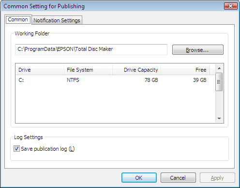

3. Click Browse to select a folder to create a Working Folder.

Note:
Select a drive with sufficient free space. For information on the necessary HDD space, see the 
following section.
& See “System Requirements” on page 15.

4. Check the checkbox for Save publication log if you want to save the usage history of 
the product.

Note:
When the log files saved in the computer exceed 200MB, the older ones will be deleted (starting 
with the oldest one) to make room for new ones.

5. Click OK.

Using Your Software
17

---

# Page 18

Adding the Product

Use the EPSON Total Disc Setup to add the product (CD/DVD/BD publisher) to the 
computer.

Note:
The product must be added when the connection point (port) is set manually. However, the product 
does not need to be added when the connection point (port) is set automatically.

1. Make sure that the product is connected to the computer via the USB cable and that the 
product is turned on.

2. Select Start (
 in Windows 7 or Windows Vista) - All Programs (or Programs) - 
EPSON Total Disc Maker - EPSON Total Disc Setup.

The EPSON Total Disc Setup will start.

3. Click Add.

4. Select Local CD/DVD/BD publisher, and then click Next.

5. Select the product to be added from CD/DVD/BD Publisher List, then click Next.

6. Enter any name and click OK.

Using Your Software
18

---

# Page 19

Setting for Notification of Job Completion

A setting can be made to display a message on the screen that notifies you that a job (or 
jobs) is finished.

Note:
This setting is reflected for all the CD/DVD/BD publishers registered.

1. Select Start (
 in Windows 7 or Windows Vista) - All Programs (or Programs) - 
EPSON Total Disc Maker - EPSON Total Disc Setup.

The EPSON Total Disc Setup will start.

2. Select Common Setting for Publishing from the Tool menu.

The Common Setting for Publishing screen will appear.

3. Click Notification Settings tab.

The Notification Settings screen will appear.

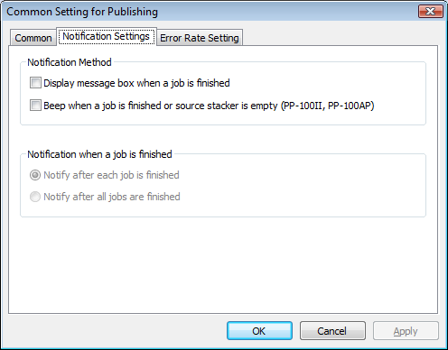

4. Check Display message box for Notification Method.

5. Select either one of the options for Notification when a job is finished.

6. Click OK.

Using Your Software
19

---

# Page 20

Overview of Applications

The EPSON Total Disc Maker software included with the product allows you to write or 
copy CDs/DVDs create CD/DVD labels, and publish CDs/DVDs.

EPSON Total Disc Maker

EPSON Total Disc Maker lets you write CDs/DVDs and print CD/DVD labels. The process 
used to write CDs/DVDs and print CD/DVD labels is called "Publish" in the EPSON Total 
Disc Maker program. Using EPSON Total Disc Maker, you can also duplicate CDs/DVDs.

EPSON Total Disc Monitor

EPSON Total Disc Monitor is a utility that monitors the product and gives you information 
about its current status. Using EPSON Total Disc Monitor, you can also pause/cancel jobs 
or change the order of jobs to be processed.

EPSON Total Disc Setup

EPSON Total Disc Setup is a utility to register the product to the computer and to set basic 
settings to publish CDs/DVDs, such as settings for the publish mode, stackers, and drives.

Using EPSON Total Disc Maker

Use EPSON Total Disc Maker to do the following:

❏ Writing data to DVDs, video to DVDs, data to CDs, music to CDs, music and data to 
CDs, or video to CDs, or copying CD/DVDs.

❏ Creating and editing CD/DVD labels.

Starting EPSON Total Disc Maker

Click Start (
 in Windows 7 or Windows Vista), point to All Programs or Programs. 

Point to EPSON Total Disc Maker, and then click EPSON Total Disc Maker.

Using Your Software
20

---

# Page 21

Getting Information through Online Help

You can access online help for EPSON Total Disc Maker from the software or from the 
Windows Start menu.

In window of EPSON Total Disc Maker, EPSON Total Disc Monitor, or EPSON Total Disc 
Setup, click the 
 button to display online help for each utility.

Overview of Printer Driver

The printer driver lets you choose from a wide variety of settings to get the best printing 
results.

Accessing the Printer Driver

You can access the printer driver from EPSON Total Disc Maker, EPSON Total Disc 
Setup, most Windows-based applications, and the Windows Start menu.

If displayed from EPSON Total Disc Maker
The settings are only reflected in EPSON Total Disc Maker. The settings are lost when you 
exit EPSON Total Disc Maker.

If displayed from EPSON Total Disc Setup or the Start menu
The information you set is saved as the printer driver settings, and after this, it is reflected 
in the printer settings for EPSON Total Disc Maker and all other applications.

Refer to the following sections to access the printer driver.

From EPSON Total Disc Maker

1. Click Start (
 in Windows 7 or Windows Vista), point to All Programs or Programs. 
Point to EPSON Total Disc Maker, and then click EPSON Total Disc Maker.

2. Select Print Settings from Tool menu.

From EPSON Total Disc Setup

1. Click Start (
 in Windows 7 or Windows Vista), point to All Programs or Programs. 
Point to EPSON Total Disc Maker, and then click EPSON Total Disc Setup.

2. Select CD/DVD/BD Publisher, and then click Properties.

Using Your Software
21

---

# Page 22

From Windows applications

1. Click Print or Print Setup in the File menu.

2. In the window that appears, click Printer, Setup, Options, Preferences, or 
Properties. (Depending on your application, you may need to click one or a 
combination of these buttons.) 

From the Start menu

1. Windows 7:
Click 
, Control Panel, then click Devices and Printers.

Windows Vista/Windows Server 2008:
Click 
 or Start, Control Panel, then click Printers.

Windows XP Professional:
Click Start, then click Printers and Faxes.

Windows XP Home Edition/Windows Server 2003:
Click Start, Control Panel, then click Printers and Faxes.

2. Right-click EPSON PP-100PRN, then click Printing Preferences in the menu.

Getting Information through Online Help

You can access online help for items in the printer driver from your application or from the 
Windows Start menu.
& See “Accessing the Printer Driver” on page 21.

In the printer driver window, try one of the following procedures.

❏ Right-click the item, then select Help.

❏ Click Help.

Using Your Software
22

---

# Page 23

Uninstalling Software

You can uninstall the software by following the steps below.

Note:
❏
In Windows 7, Windows Vista, or Windows Server 2008, you may be asked for an administrator 
password or confirmation when uninstalling the software. When asked for a password, enter the 
password to proceed with the operation.

❏
In Windows XP or Windows Server 2003, log onto Windows as a user with administrator 
privileges (belonging to the administrator group) to uninstall the software.

❏
When installing the software, various Microsoft components may be installed. Some of them 
may not be uninstalled when uninstalling the software.

1. Close all applications.

2. Click Start (
 in Windows 7 or Windows Vista), and then select Control Panel.

3. Click Uninstall a program (Windows 7, Windows Vista, or Windows Server 2008) or 
double-click the Add or Remove Programs icon (Windows XP or Windows Server 
2003).

4. Choose EPSON Total Disc Maker.

5. Click Uninstall/Change (Windows 7, Windows Vista, or Windows Server 2008) or click 
Change/Remove (Windows XP or Windows Server 2003).

Note:
If you cannot perform the uninstallation due to any problem, uninstall the software by 
double-clicking setup.exe in Discproducer Utility & Documents Disc.

6. Select Remove and click Next.

7. When the confirmation message appears, click Yes.

8. Follow the on-screen instructions.

Using Your Software
23

---

# Page 24

Chapter 2 
Publishing Discs

Introduction

This section guides you through the procedures for creating and printing CDs/DVDs.

Note:
For information on CDs/DVDs, see the following section.
& See “Discs” on page 120.

Turning Power On/off

This section describes how to turn on/off power.

Turning power on

1. Connect the power cable.

2. Press P Power button until the power light flashes.

Power light flashes in green, then stays on.

Turning power off

Press the P Power button. The 
Power light will flash in green then turn off; then 
power is turned off.
c
Caution:
❏
Fan will operate after turning power off, but it will automatically stop after 15 minutes.

❏
If the product is operating, wait for 10 seconds after operation is stopped, then turn off 
power.

❏
The product may not be recognized by the computer when the power is turned back on 
while fan is operating. In this case, disconnect the USB cable and connect it again.

Note:
❏
If turning off the product while power on the PC is on, follow the procedure below. If the product 
is turned off without following the procedure, data in the PC maybe damaged.
1. If Total Disc Maker, Total Disc Monitor, or Total Disc Setup is running, close the software.
2. Double click "Safely Remove Hardware" on the task tray.
3. Select DVD drive on the product and select Stop.

Publishing Discs
24

---

# Page 25

Overview of Publish Modes

To write data to CDs/DVDs and to print labels that you created/edited are called “Publish” 
in EPSON Total Disc Maker. The product has three kinds of publish modes.

Standard Mode

This mode uses stacker 1 as the input stacker, and stacker 2, 3, or 4 as the output stacker.

When stacker 2 or 3 is selected as the output stacker, up to 50 CDs/DVDs can be created 
at once. Also, if you refill discs in the input stacker and take out published discs from the 
output stacker at the same time, up to 1000 CDs/DVDs can be published in a single job. 

If stacker 4 is selected as the output stacker, discs can be removed without stopping the 
product while running a job.

& See “Standard Mode” on page 31.

External Output Mode

This mode uses stacker 1 and 2 as the input stackers, and stacker 3 or 4 as the output 
stacker.

Different types of discs (CD and DVD) can be loaded into each of the 2 stackers and can 
create different types of discs. This is ideal for creating small batches of discs at once.

If the same type of discs are loaded into stacker 1 and 2 and Auto is selected for the input 
stacker setting, up to 100 CDs/DVDs can be continuously published by taking out 
published discs without refilling discs.

Up to 1000 CDs/DVDs can be continuously published in a single job by refilling discs and 
taking out published discs.

If stacker 4 is selected as the output stacker, discs can be removed without stopping the 
product while running a job.

Note:
This mode does not use stacker 3 if you select stacker 4 as the output stacker.

& See “External Output Mode” on page 44.

Batch Mode

This mode uses stacker 1 and 2 as the input stackers, and stacker 2 and 3 as the output 
stackers. 

Publishing Discs
25

---

# Page 26

You can create up to 100 CDs/DVDs at once without refilling and taking out discs while 
publishing. Up to 1000 CDs/DVDs can be continuously published in a single job by refilling 
discs and taking out published discs. To use this mode, you need to place stacker 3 into 
the product.

& See “Batch Mode” on page 58.

Drive Settings

Drive to be used

Select Drive to Use from the following.

Use Both

Use both drive 1 and 2 to write data. Jobs will be efficiently processed by using 2 drives. If 
trouble occurrs on either drive and it cannot write data, other drive will be used 
automatically.

Use Drive 1 Only

Use only drive 1.

Use Drive 2 Only

Use only drive 2.

Number of write retries

Select 0 to 9 for the Number of write retries.

The Number of write retries is a setting to retry writing if a write error occurs.

Setting the Number of write retries will enable the job to continue without pausing if a write 
error occurrs.

Printer Settings

Printer name

Select Printer Name.

Publishing Discs
26

---

# Page 27

Note:
When changing the printer name, do not use Unicode characters. The device will not be recognized 
correctly.

Failure error mark

If you check this check box, an error mark will be printed on any disc with a write error. This 
is useful to identify the disc which encountered the write error.

Note:
The error mark will not be printed in the following cases.

❏
The job was canceled

❏
An incorrect disc type was found in the stacker

❏
Fatal error

❏
Not enough ink was left to print the error mark

Notice for CD/DVD Writing and Printing

❏ Store the stacker out of direct sunlight. A warped or damaged stacker may stop the 
product from operating normally.

❏ Use only CDs/DVDs labeled as suitable for printing, for example “Printable on the label 
surface” or “Printable with ink jet printers.”

❏ For more details on handling CDs/DVDs and for guidelines for writing data to 
CDs/DVDs, refer to your CD/DVD documentation.

❏ When using the product for the first time after storing it for a long time or after an error, 
missing dots or ink stains may appears and print quality may be reduced. If publishing 
a large number of discs, check print quality by publishing one disc in advance. If any 
dots are missing, run head cleaning.

❏ When writing and printing discs separately, it is recommended to print after writing. If 
you write discs after printing, ink may cause discs to stick to each other and result in a 
transport error, or dirt, stains, or scratches on the disc may cause a write error. 

❏ Printing on rib area may result in ink sticking, disc sticking, or color loss.

❏ Try to test print on a spare CD/DVD, and check the printed surface after waiting for one 
full day, especially before printing a large number of CDs/DVDs.

❏ After printing the first copy, check the print quality to see if any dots are missing.

Publishing Discs
27

---

# Page 28

❏ Before using or touching the printed surface of your CDs/DVDs, make sure they are 
completely dry and keep them out of direct sunlight.

❏ If the printed surface is sticky even after it has dried, do the following.
1. Change label type.
2. Change color saturation level.
3. Change the disc.

❏ Moisture on the printable surface may cause smearing.

❏ If you print on the matte label type of Epson specified discs, set Label Type to CD/DVD 
Premium Label.

❏ When using Epson specified discs, only [1] can be selected for Print Mode setting.

❏ Reprinting on the same disc may not improve the print quality.

❏ Be sure to clean the inside of the stacker before using if there is any dirt.

❏ Please check disc before printing, as the size of the receptor may vary.

❏ Ink may not bond if printed outside the receptor.

❏ If the product is operating, wait for 10 seconds after the operation is finished, and then 
turn the power off.

❏ Data may be lost depending on the disc or storing condition; therefore, store important 
data on multiple discs. Epson does not guarantee the data against loss.

❏ Do not insert a disc between DVD drive 1 and DVD drive 2, as you may not be able to 
remove it.

❏ Do not insert an object like a screwdriver or clip into the CD/DVD slots as this may 
cause a malfunction.

❏ A published CD/DVD may not be readable on another type of drive or player due to 
compatibility.

❏ The quality of the blank disc determines print and write quality. It is recommended to 
use only the specified disc type.

❏ It is recommended that you run a compare while writing data.

❏ Making a backup is recommended if the data is important. Recorded data may degrade 
over long storing periods. It is recommended to make backups periodically.

❏ Do not shock or vibrate the product while reading or writing, as this may result in 
malfunction of the drive or make the disc unusable.

Publishing Discs
28

---

# Page 29

❏ Do not use a cracked, warped, or deformed disc because it may break in pieces inside 
the product and cause malfunction or injury.

❏ A disc may become unreadable or unwritable if it has a small scratch or dirt; therefore, 
please handle it with care. 

❏ Hold disc by the edge, and do not touch either surface.

❏ The completed job display of EPSON Total Disc Monitor shows the number of 
successes, number of failures, and number of discs printed.

❏ Do not use discs with lens cleaner, a label sticker, or condensation on them as it may 
cause mechanical error or malfunction.

❏ If the file system of the computer used is FAT, DVD writing may not be possible.

Error Discs

Discs with write error will be ejected to different stackers depending on the output stacker.

❏ When stacker 2 is set as the output stacker: 
Ejected to stacker 3 (when stacker 3 is used) or stacker 4 (when stacker 3 is not used).

❏ When stacker 3 is set as the output stacker:
Ejected to stacker 3.

❏ When stacker 4 is set as the output stacker:
Ejected to stacker 4.

Note:
You can print an error mark on any disc with a write error to identify error discs.
& See “Failure error mark” on page 27.

Precautions for Duplicating CDs/DVDs

❏ Please use a CD/DVD drive that supports MMC 4.0-compatible commands and 
operates in conformity with MMC 4.0 as a source drive for copying. (Please check the 
Epson website for a list of drives for which operation has been verified.)

❏ Copying CDs/DVDs may not be possible depending on the type of CD/DVD source 
drive used. If problems occur, please try using a different CD/DVD source drive for 
copying.

Publishing Discs
29

---

# Page 30

❏ To copy from the drive using EPSON Total DIsc Maker, please log onto Windows as a 
user with administrator privileges (belonging to the administrator group). Otherwise, 
copying is not possible, because certain parts of the drive cannot be accessed with a 
limited user account. 

❏ If the source disc is a multi-session CD/DVD, it cannot be copied.

❏ If the source disc is a packet-written CD, it cannot be copied.

Printing on CDs/DVDs with a Commercially Available Software 
Package

When you print on CDs/DVDs with a commercially available software package that 
supports CD/DVD printing, you have to make the following settings.

Size
124 x 124 mm (4.88 x 4.88")

Type
CD/DVD Label, CD/DVD Premium Label, or Epson 
Specified CD/DVD Label

Margins on all sides
2 mm (0.08")

Notice for Barcode Printing

❏ When printing barcodes and 2D codes, be sure to use Epson brand ink cartridges.

❏ When printing barcodes and 2D codes on discs that are not Epson specified discs, 
check whether the printed barcodes or 2D codes can be read correctly by a scanner.

❏ Do not place barcodes or 2D codes where they overlap other print data, or where they 
extend beyond the print area.

❏ Barcodes and 2D codes use the ratio of black to white to indicate information. If ink 
penetration results in a deterioration of the ratio of black to white, barcodes and 2D 
codes may not be able to be read correctly. Check whether the printed barcodes and 
2D codes can be read correctly by a scanner.

❏ If a barcode printed with bidirectional printing cannot be read correctly, align the print 
head and then print the barcode, or print the barcode with unidirectional printing.

Publishing Discs
30

---

# Page 31

Standard Mode

Loading Discs

Follow the steps below to load discs.

1. Open the disc cover.

2. Take out stacker 1.

3. Fan a stack of discs to prevent them from sticking together. Be careful not to scratch the 
recording side of the discs.

Publishing Discs
31

---

# Page 32

4. Load discs into stacker 1 with the printable side facing up.

c
Caution:
Do not load the discs above the dotted line marked on the stacker; otherwise, the discs or 
product may be damaged.

5. Insert stacker 1.

Publishing Discs
32

---

# Page 33

6. If you use stacker 3 for the following cases, insert stacker 3.

❏ When you select stacker 3 as the output stacker.

❏ When you select stacker 2 as the output stacker and want to eject error discs to 
stacker 3.

c
Caution:
❏
Make sure that there are no discs in stackers 3 and 4.

❏
Do not pull out stacker 4. Be sure to lock the lock lever located on stacker 4.

7. If you select stacker 4 as the output stacker, unlock the lock lever located on stacker 4.

Publishing Discs
33

---

# Page 34

8. Close the disc cover.

Accessing EPSON Total Disc Maker

After loading discs into the stacker, access EPSON Total Disc Maker to make settings for 
writing discs, and create the labels printed on the discs.

Click Start (
 in Windows 7 or Windows Vista), point to All Programs or Programs. 
Point to EPSON Total Disc Maker, and then click EPSON Total Disc Maker.

To learn how to use EPSON Total Disc Maker, go to the Help menu.

Registering Data

The following instructions explain how to register data to be written on discs.

1. Start EPSON Total Disc Maker and click Disc on the menu bar of EPSON Total Disc 
Maker.

Publishing Discs
34

---

# Page 35

2. Select type of discs to be published from the list, then click Apply.

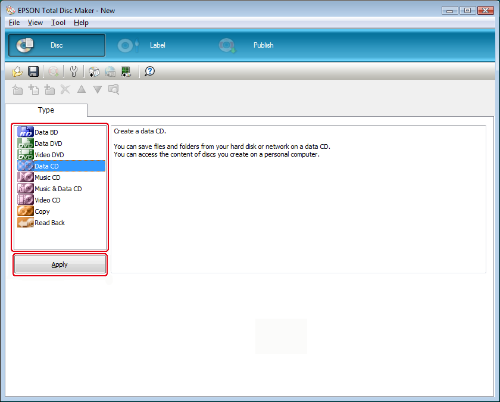

Publishing Discs
35

---

# Page 36

3. Drag and drop files or folders to the data tree or data list. For details, see Help for 
EPSON Total Disc Maker.

Note:
❏
Clicking Auto Insert Data... enables you to set for Merge data and burn. For details, see Help 
for EPSON Total Disc Maker.

❏
To access Help for EPSON Total Disc Maker, select Help from the Help menu.

Publishing Discs
36

---

# Page 37

Creating Labels

The following instructions explain how to create labels using templates provided with the 
software.

1. Click Label on the menu bar of EPSON Total Disc Maker.

Publishing Discs
37

---

# Page 38

2. Click Template tab and select a label design from the list, then click Apply.

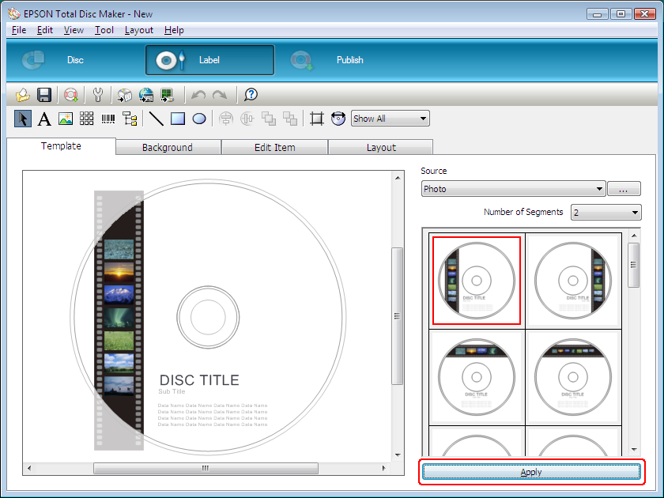

Publishing Discs
38

---

# Page 39

3. Make changes on the label as needed in the Background, Edit Item, and Layout tabs. 
For details, see Help for EPSON Total Disc Maker.

Note:
To access Help for EPSON Total Disc Maker, select Help from the Help menu.

Publishing Discs
39

---

# Page 40

Making the Stacker Settings

The following instructions explain how to set stackers.

1. Click Publish on the menu bar of EPSON Total Disc Maker.

2. Click Properties on the Publish screen of EPSON Total Disc Maker or EPSON Total 
Disc Setup.

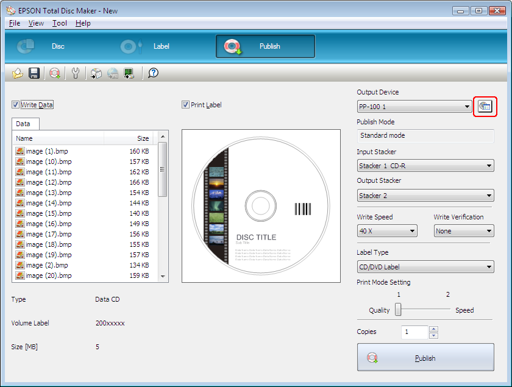

Publishing Discs
40

---

# Page 41

3. Set Stacker Settings.

❏ Publish Mode: Select Standard mode.

❏ Stacker 1: 
Select the type of discs that you loaded into stacker 1.

❏ Stacker 3: 
If you want to eject published discs to stacker 2 and error discs to 
stacker 3, select Use.
If you want to eject published discs to stacker 2 and error discs to 
stacker 4, select Do not use.
If you want to eject published discs to stacker 3, select Use.
If you want to eject published discs to stacker 4, select Do not 
use.

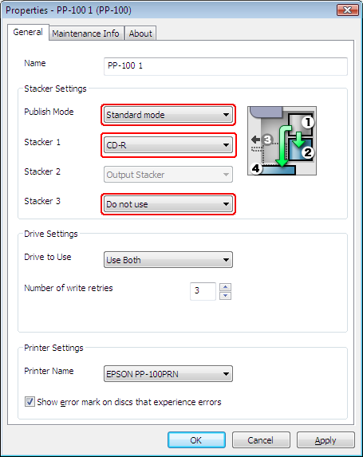

4. Click OK.

Publishing Discs
41

---

# Page 42

Publishing Discs

The following instructions explain how to publish discs.

1. Make the publish settings on the Publish screen of EPSON Total Disc Maker. For 
details, see Help for EPSON Total Disc Maker.

Note:
To access Help for EPSON Total Disc Maker, select Help from the Help menu.

2. Click the Publish button.

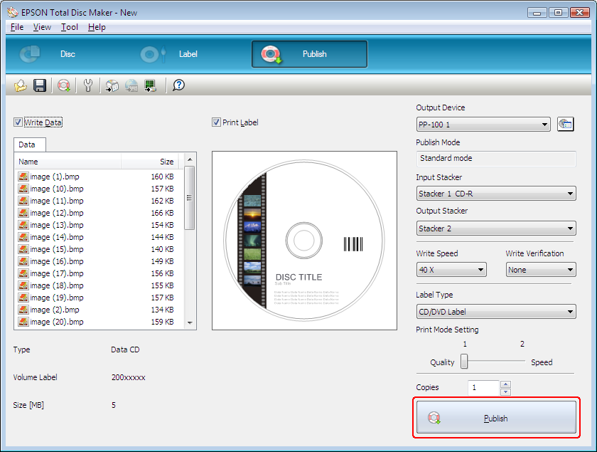

Publishing Discs
42

---

# Page 43

c
Caution:
❏
Do not open the disc cover while the product is publishing discs, unless the application 
instructs you to add or remove discs. This may affect write quality or print quality. Also, do 
not put your hands inside the product while it is beeping, as arm is still moving.

❏
Beep will sound if you open disc cover while running a job, and the job will pause. Closing 
the disc cover automatically resumes the job.

❏
Do not operate the stacker while the unit is beeping, as the arm may be damaged.

❏
If you need to open the disc cover, pause or cancel your job before opening it.

❏
Do not open the ink cartridge cover while running a job.

❏
Depending on the disc or the computer used, writing speed may become slower than the 
set speed.

❏
Depending on the disc used, the recommended writing speed of the disc cannot be used. 
In this case, reduce the writing speed. Especially with DVD±R DL, it is recommended to 
write with slow speed.

Note:
If Windows shuts down while processing a job, the job may be resumed when Windows restarts 
next time.

Publishing Discs
43

---

# Page 44

External Output Mode

Loading Discs

Follow the steps below to load discs.

1. Open the disc cover.

2. Take out stacker 1.

3. Fan a stack of discs to prevent them from sticking together. Be careful not to scratch the 
recording side of the discs.

Publishing Discs
44

---

# Page 45

4. Load discs into stacker 1 with the printable side facing up.

c
Caution:
Do not load the discs above the dotted line marked on the stacker; otherwise, the discs or 
product may be damaged.

5. Insert stacker 1.

Publishing Discs
45

---

# Page 46

6. Take out stacker 2.

7. Fan a stack of discs to prevent them from sticking together. Be careful not to scratch the 
recording side of the discs.

8. Load discs into stacker 2 with the printable side facing up.

c
Caution:
Do not load the discs above the dotted line marked on the stacker; otherwise, the discs or 
product may be damaged.

Publishing Discs
46

---

# Page 47

9. Insert stacker 2.

10.If you select stacker 3 as the output stacker, insert stacker 3.

c
Caution:
❏
Make sure that there are no discs in stackers 3 and 4.

❏
Do not pull out stacker 4. Be sure to lock the lock lever located on stacker 4.

Publishing Discs
47

---

# Page 48

11.If you select stacker 4 as the output stacker, unlock the lock lever located on stacker 4.

c
Caution:
Do not install stacker 3.

12.Close the disc cover.

Accessing EPSON Total Disc Maker

After loading discs into the stackers, access EPSON Total Disc Maker to make settings for 
writing discs, and create the labels printed on the discs.

Click Start (
 in Windows 7 or Windows Vista), point to All Programs or Programs. 
Point to EPSON Total Disc Maker, and then click EPSON Total Disc Maker.

To learn how to use EPSON Total Disc Maker, go to the Help menu.

Registering Data

The following instructions explain how to register data to be written on discs.

1. Start EPSON Total Disc Maker and click Disc on the menu bar of EPSON Total Disc 
Maker.

Publishing Discs
48

---

# Page 49

2. Select type of discs to be published from the list, then click Apply.

Publishing Discs
49

---

# Page 50

3. Drag and drop files or folders to the data tree or data list. For details, see Help for 
EPSON Total Disc Maker.

Note:
❏
Clicking Auto Insert Data... enables you to set for Merge data and burn. For details, see Help 
for EPSON Total Disc Maker.

❏
To access Help for EPSON Total Disc Maker, select Help from the Help menu.

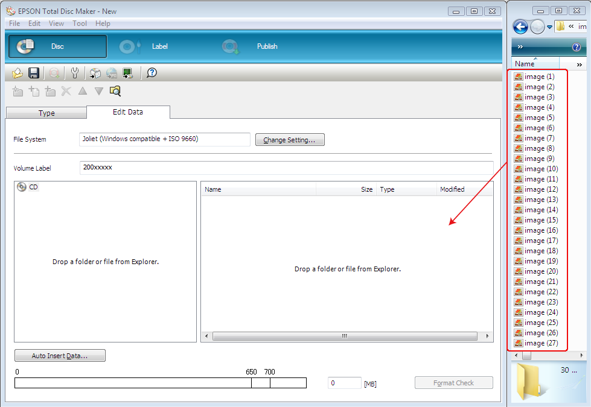

Publishing Discs
50

---

# Page 51

Creating Labels

The following instructions explain how to create labels using templates provided with the 
software.

1. Click Label on the menu bar of EPSON Total Disc Maker.

Publishing Discs
51

---

# Page 52

2. Click Template tab and select a label design from the list, then click Apply.

Publishing Discs
52

---

# Page 53

3. Make changes on the label as needed in the Background, Edit Item, and Layout tabs. 
For details, see Help for EPSON Total Disc Maker.

Note:
To access Help for EPSON Total Disc Maker, select Help from the Help menu.

Publishing Discs
53

---

# Page 54

Making the Stacker Settings

The following instructions explain how to set stackers.

1. Click Publish on the menu bar of EPSON Total Disc Maker.

2. Click Properties on the Publish screen of EPSON Total Disc Maker or EPSON Total 
Disc Setup.

Publishing Discs
54

---

# Page 55

3. Set Stacker Settings.

❏ Publish Mode: Select External Output mode.

❏ Stacker 1: 
Select the type of discs that you loaded into stacker 1.

❏ Stacker 2: 
Select the type of discs that you loaded into stacker 2.

❏ Stacker 3: 
If you want to eject published discs to stacker 3, select Output 
Stacker.
If you want to eject published discs to stacker 4, select Do not 
use.

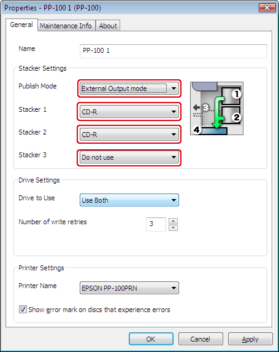

4. Click OK.

Publishing Discs
55

---

# Page 56

Publishing Discs

The following instructions explain how to publish discs.

1. Make the publish settings on the Publish screen of EPSON Total Disc Maker. For 
details, see Help for EPSON Total Disc Maker.

Note:
To access Help for EPSON Total Disc Maker, select Help from the Help menu.

2. Click the Publish button.

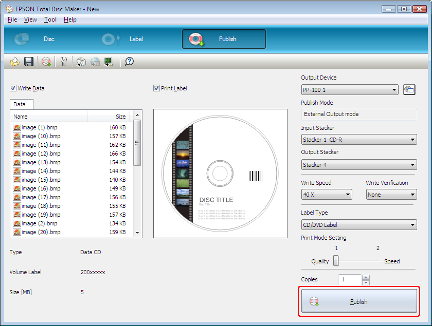

Publishing Discs
56

---

# Page 57

c
Caution:
❏
Do not open the disc cover while the product is publishing discs, unless the application 
instructs you to add or remove discs. This may affect write quality or print quality. Also, for 
safety reasons, do not put your hands inside the product while it is beeping, as arm is still 
moving.

❏
Beep will sound if you open disc cover while running a job, and the job will pause. Closing 
the disc cover automatically resumes the job.

❏
Do not operate the stacker while the unit is beeping, as the arm may be damaged.

❏
If you need to open the disc cover, pause or cancel your job before opening it.

❏
Do not open the ink cartridge cover while running a job.

❏
Depending on the disc or the computer used, writing speed may become slower than the 
set speed.

❏
Depending on the disc used, the recommended writing speed of the disc cannot be used. 
In this case, reduce the writing speed. Especially with DVD±R DL, it is recommended to 
write with slow speed.

Note:
If Windows shuts down while processing a job, the job may be resumed when Windows restarts 
next time.

Publishing Discs
57

---

# Page 58

Batch Mode

Loading Discs

Follow the steps below to load discs.

1. Open the disc cover.

2. Take out stacker 1.

3. Fan a stack of discs to prevent them from sticking together. Be careful not to scratch the 
recording side of the discs.

Publishing Discs
58

---

# Page 59

4. Load discs into stacker 1 with the printable side facing up.

c
Caution:
Do not load the discs above the dotted line marked on the stacker; otherwise, the discs or 
product may be damaged.

5. Insert stacker 1.

Publishing Discs
59

---

# Page 60

6. Take out stacker 2.

7. Fan a stack of discs to prevent them from sticking together. Be careful not to scratch the 
recording side of the disc.

8. Load discs into stacker 2 with the printable side facing up.

c
Caution:
Do not load the discs above the dotted line marked on the stacker; otherwise, the discs or 
product may be damaged.

Publishing Discs
60

---

# Page 61

9. Insert stacker 2.

10.Insert stacker 3.

c
Caution:
❏
Make sure that there are no discs in stackers 3 and 4.

❏
Do not pull out stacker 4. Be sure to lock the lock lever located on stacker 4.

Publishing Discs
61

---

# Page 62

11.Close the disc cover.

Accessing EPSON Total Disc Maker

After loading discs into the stackers, access EPSON Total Disc Maker to make settings for 
writing discs, and create the labels printed on the discs.

Click Start (
 in Windows 7 or Windows Vista), point to All Programs or Programs. 
Point to EPSON Total Disc Maker, and then click EPSON Total Disc Maker.

To learn how to use EPSON Total Disc Maker, go to the Help menu.

Publishing Discs
62

---

# Page 63

Registering Data

The following instructions explain how to register data to be written on discs.

1. Start EPSON Total Disc Maker and click Disc on the menu bar of EPSON Total Disc 
Maker.

2. Select type of discs to be published from the list, then click Apply.

Publishing Discs
63

---

# Page 64

3. Drag and drop files or folders to the data tree or data list. For details, see Help for 
EPSON Total Disc Maker.

Note:
❏
Clicking Auto Insert Data... enables you to set for Merge data and burn. For details, see Help 
for EPSON Total Disc Maker.

❏
To access Help for EPSON Total Disc Maker, select Help from the Help menu.

Publishing Discs
64

---

# Page 65

Creating Labels

The following instructions explain how to create labels using templates provided with the 
software.

1. Click Label on the menu bar of EPSON Total Disc Maker.

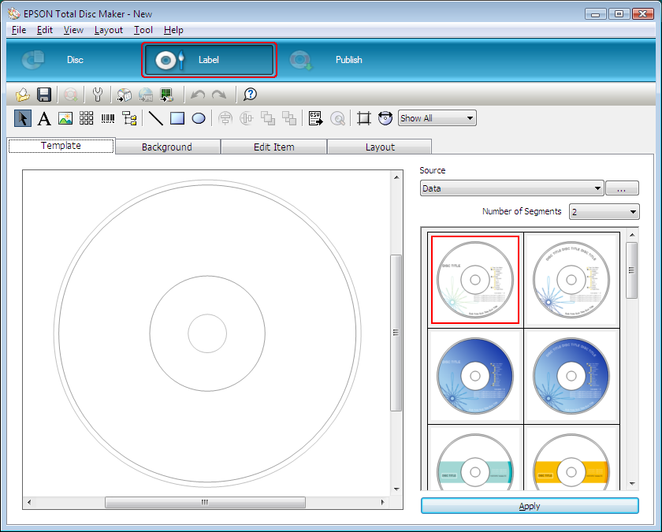

Publishing Discs
65

---

# Page 66

2. Click Template tab and select a label design from the list, then click Apply.

Publishing Discs
66

---

# Page 67

3. Make changes on the label as needed in the Background, Edit Item, and Layout tabs. 
For details, see Help for EPSON Total Disc Maker.

Note:
To access Help for EPSON Total Disc Maker, select Help from the Help menu.

Publishing Discs
67

---

# Page 68

Making the Stacker Settings

The following instructions explain how to set stackers.

1. Click Publish on the menu bar of EPSON Total Disc Maker.

2. Click Properties on the Publish screen of EPSON Total Disc Maker or EPSON Total 
Disc Setup.

Publishing Discs
68

---

# Page 69

3. Set Stacker Settings.

❏ Publish Mode: Select Batch mode.

❏ Stacker 1: 
Select the type of discs that you loaded into stackers 1 and 2.

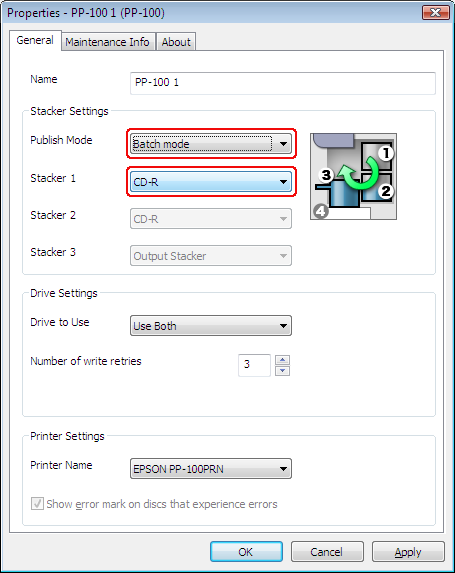

4. Click OK.

Publishing Discs
69

---

# Page 70

Publishing Discs

1. Make the publish settings on the Publish screen of EPSON Total Disc Maker. For 
details, see Help for EPSON Total Disc Maker.

Note:
To access Help for EPSON Total Disc Maker, select Help from the Help menu.

2. Click the Publish button.

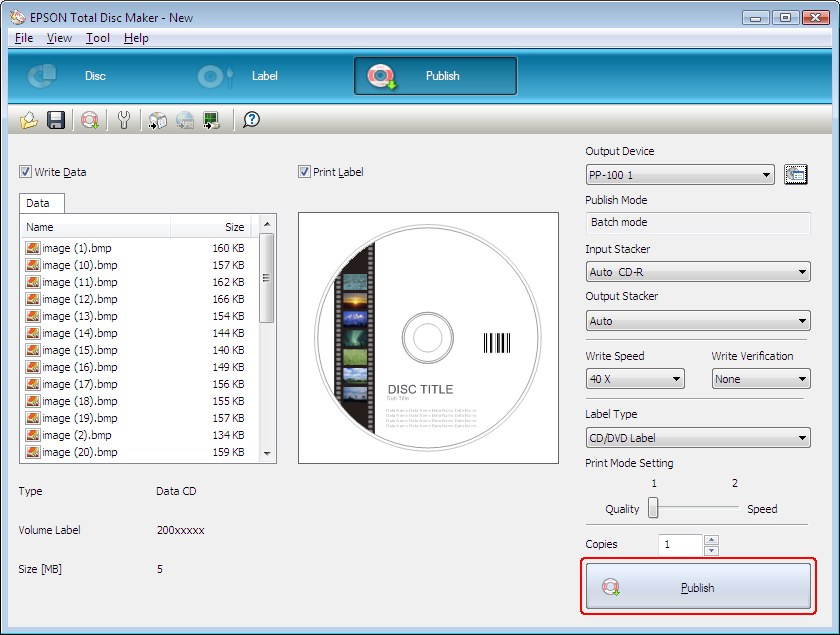

Publishing Discs
70

---

# Page 71

c
Caution:
❏
Do not open the covers while the product is publishing discs, unless the application 
instructs you to add or remove discs. This may affect write quality or print quality. Also, for 
safety reasons, do not put your hands inside the product while it is beeping, as arm is still 
moving.

❏
Beep will sound if you open disc cover while running a job, and the job will pause. Closing 
the disc cover automatically resumes the job.

❏
Do not operate the stacker while the unit is beeping, as the arm may be damaged.

❏
If you need to open the covers, pause or cancel your job before opening it.

❏
Do not open the ink cartridge cover while running a job.

❏
Depending on the disc or the computer used, writing speed may become slower than the 
set speed.

❏
Depending on the disc used, the recommended writing speed of the disc cannot be used. 
In this case, reduce the writing speed. Especially with DVD±R DL, it is recommended to 
write with slow speed.

Note:
If Windows shuts down while processing a job, the job may be resumed when Windows restarts 
next time.

Publishing Discs
71

---

# Page 72

Taking Out Discs

Follow the steps below to take out the published discs from the stackers.
c
Caution:
If you select stacker 4 as the output stacker in Standard mode or External Output mode,

❏
Do not yank stacker 4 when pulling it out to remove published discs.

❏
Do not pull out stacker 4 when the stacker 4 LED is flashing fast. Discs may be damaged.

1. Open the disc cover (only for output to stacker 2 or 3), and take out the stacker. 

2. Take out the published discs from the stacker. The output stacker differs according to 
the publish mode. Refer to the following table.

Output stacker
Publish mode
Number of discs

Stacker 2
Standard mode 

Up to about 50 discs

Batch mode

Up to about 50 discs

Stacker 3
Standard mode

External Output mode

Batch mode

Stacker 4
Standard mode

Up to about 5 discs

External Output mode

Stacker 2
Stacker 3
Stacker 4

Note:
❏
Be sure to let printed discs dry completely before using them or touching the printed surface. 
Allow Epson specified discs to dry for at least 1 hour and other types of discs for at least 24 
hours.

Publishing Discs
72

---

# Page 73

❏
If the print position is misaligned, adjust it using the printer driver. For details, refer to the printer 
driver Help.

❏
If the ink smears, adjust the color saturation. For details, refer to the printer driver Help.

❏
When publishing discs using Batch mode, the number of discs output to stacker 3 is not always 
the same as the number of discs loaded into stacker 2. Also, the number of discs does not 
always become 50. The same applies to the number of discs output to stacker 2. For Batch 
mode, the output stacker switches to stacker 2 when the ejected discs accumulated in stacker 
3 reach the height limit. As a result, the number of discs output to the stacker depends on the 
thickness of the discs used.

Publishing Discs
73

---

# Page 74

Pausing Publishing

If you need to pause publishing, follow the instructions below.

When you start publishing, the screen of EPSON Total Disc Monitor appears on your 
computer screen. Select the job you want to pause in the Unfinished Job list, and then 
select Pause Job from the Job menu or click 
 button.

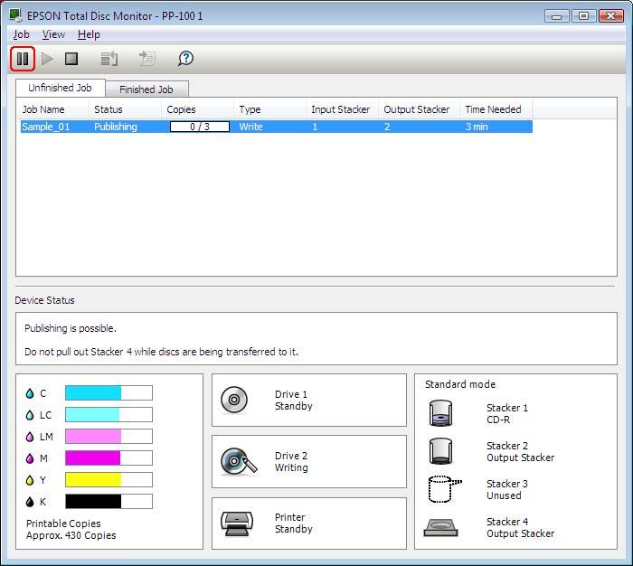

Note:
❏
If there is a disc being published, the job is paused after the processing is finished.

❏
The processing of any subsequent job also does not start while the job is paused. 

Publishing Discs
74

---

# Page 75

Resuming Publishing

If you need to resume publishing, follow the instructions below.

Start EPSON Total Disc Monitor. Select the job you want to resume in the Unfinished Job 
list, and then select Resume Job from the Job menu or click 
 button.

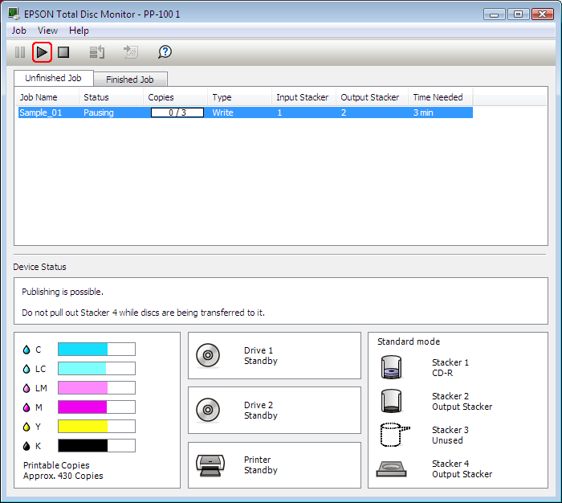

Publishing Discs
75

---

# Page 76

Canceling Publishing

If you need to cancel publishing, follow the instructions below.

Start EPSON Total Disc Monitor. Select the job you want to cancel in the Unfinished Job 
list, and then select Cancel Job from the Job menu or click 
 button.

Note:
If a disc is being published, that processing is stopped, and the disc is output to the output stacker.

Publishing Discs
76

---

# Page 77

Priority Publishing

If you need to process a job before the others when more than one job is being published, 
follow the instructions below.

Start EPSON Total Disc Monitor. Select the job you want to give priority to in the Unfinished 
Job list, and then select Priority Publishing from the Job menu or click 
 button. The 
selected job will be processed after the job in progress.

Note:
Any job cannot be given priority before such operations as nozzle checking, aligning print head, and 
correcting printing position.

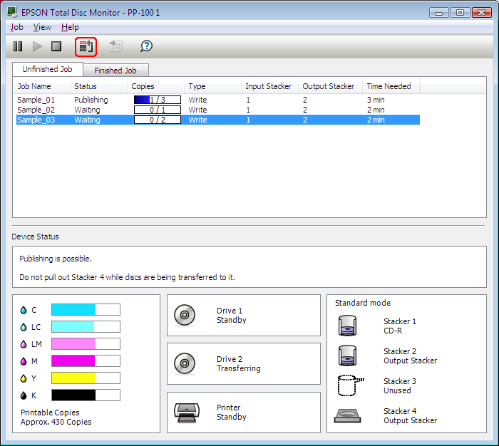

Publishing Discs
77

---

# Page 78

Chapter 3 
Replacing Ink Cartridges

Checking the Ink Cartridge Status

Note:
❏
Epson cannot guarantee the quality or reliability of ink not made by EPSON.

❏
When an ink cartridge is running low, the status is displayed on the EPSON Total Disc Monitor.

To check the ink cartridge status, do the following:

❏ EPSON Total Disc Monitor appears automatically when you start a job. You can check 
the ink cartridge status from this window.
You can also run EPSON Total Disc Monitor from the Start menu.
& See “Using EPSON Total Disc Monitor” on page 100.

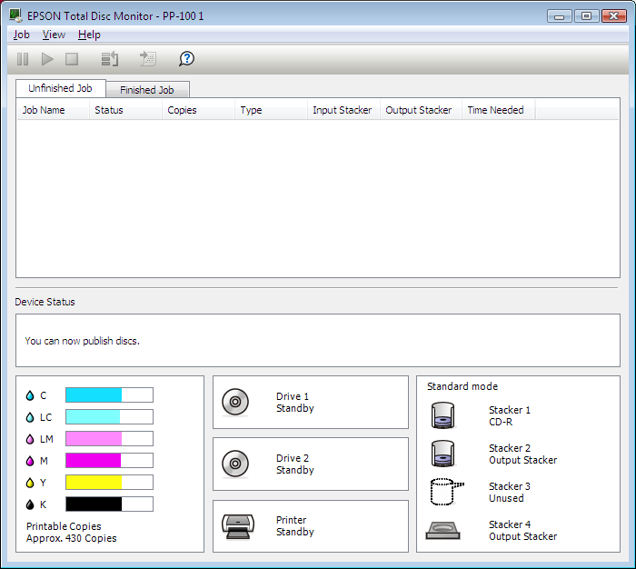

Note:
If any of the ink cartridges installed in the product is broken, incompatible with the product 
model, or improperly installed, EPSON Total Disc Monitor will not display an accurate 
calculation of the ink cartridge status. Be sure to replace or reinstall any such ink cartridge with 
an ink cartridge supported by the product.

Replacing Ink Cartridges
78

---

# Page 79

Precautions on Ink Cartridge Replacement

Read all the instructions in this section before replacing the ink cartridges.

❏ Install all six ink cartridges. Disc publishing (write/print) cannot be done if even only one 
ink cartridge is missing.

❏ This product uses ink cartridges equipped with an IC chip that monitors the amount of 
ink used by each cartridge. Cartridges are usable even if they are removed and 
reinserted. However, some ink is consumed each time cartridges are inserted, because 
the product automatically checks their reliability.

❏ The valve in the ink supply port is designed to contain any excess ink that may be 
released. However, careful handling is recommended. Do not touch the supply port of 
the ink cartridge or its surrounding area.

❏ Ink is consumed during the following operations: ink charging when an ink cartridge is 
installed, print head cleaning, and automatic cleaning executed periodically.

❏ For maximum ink efficiency, only remove an ink cartridge when you are ready to 
replace it. Ink cartridges with low ink status may not be used when reinserted.

❏ Do not refill the ink cartridges. Other products not manufactured by Epson may cause 
damage that is not covered by Epson's warranties, and under certain circumstances, 
may cause erratic product behavior.

❏ Keep ink cartridges out of the reach of children. Do not allow children to drink from or 
handle the cartridges.

❏ Be careful when you handle used ink cartridges, as there may be some ink around the 
ink supply port. If ink gets on your skin, wash the area thoroughly with soap and water. 
If ink gets into your eyes, flush them immediately with water. If discomfort or vision 
problems continue after a thorough flushing, see a doctor immediately.

❏ Epson recommends the use of genuine Epson ink cartridges. The use of non-genuine 
ink may cause damage that is not covered by Epson's warranties, and under certain 
circumstances, may cause erratic product behavior.

❏ Do not open the ink cartridge package until you are ready to install it in the product.

❏ Use ink cartridges within six months after opening the packages.

❏ Leave the old cartridge installed in the product until you have obtained a replacement; 
otherwise, ink remaining in the print head nozzles may dry out.

Replacing Ink Cartridges
79

---

# Page 80

❏ You cannot continue printing with an ink cartridge after it has reached its replacement 
time, even if the other cartridges still contain ink. Before printing, replace the used 
cartridge.

❏ Do not turn off the product or open the ink cartridge cover while loading ink (Power light 
is flashing). Opening of covers may cause the ink to reload, resulting in more of the ink 
being consumed. Also, normal printing may be disturbed.

❏ If the ink cartridge is not recognized even if it is correctly installed, dirt may be attached 
to the green circuit board. Remove the cartridge, wipe the circuit board with a soft cloth 
and install it again.

❏ Color adjustment of the product is based on the use of genuine Epson ink cartridges. 
Use of non-genuine ink cartridges may result in reduced print quality and the product 
performance may not be optimum.

❏ When the Ink lamp is flashing or lit, the ink cartridge is not correctly installed. Check that 
it is installed correctly.

❏ If installing an ink cartridge does not provide normal printing, press the Cleaning button 
for 3 seconds. If it does not resolve the problem, repeat the process for 1 or 2 times.

❏ By turning off the product using the Power button, print head is automatically covered 
to prevent ink from drying. When not in use after installing ink cartridges, make sure to 
turn off using the Power button. Do not unplug the power cord or shut down the breaker 
while the power is on.

❏ When moving or transporting the product after installing ink cartridges, move or 
transport with ink cartridges installed.

Replacing an Ink Cartridge

Note:
❏
Do not open the ink cartridge package until you are ready to install it in the product.

❏
To confirm the status of each ink cartridge, see the following section:

& See “Using EPSON Total Disc Monitor” on page 100.

Replacing Ink Cartridges
80

---

# Page 81

This table describes the status of the lights and the actions you need to take.

Lights
Action

Ink is low. Obtain a replacement ink cartridge.

The ink cartridge has reached its replacement time. Replace the 
used ink cartridge with a new one.

 : flashing 
 : on

To replace an ink cartridge, follow the steps below.
c
Caution:
Do not remove the cartridge from the product until you are ready to replace it with another.

Note:
The illustrations show replacement of the light magenta ink cartridge, but the instructions are the 
same for all the cartridges.

1. Make sure that the 
 Power light is on, but not flashing.

2. Open the ink cartridge cover.

Note:
Wait for 4 seconds or more before removing the ink cartridge. Otherwise, ink may squirt.

Replacing Ink Cartridges
81

---

# Page 82

3. Push in the used cartridge so the cartridge pops out slightly. 

4. Carefully pull the used cartridge straight out of the slot. Dispose of it properly.

5. Remove the new ink cartridge from the package.
c
Caution:
❏
Do not touch the green IC chip on the side of the cartridge. This can damage the ink 
cartridge.

❏
Always install an ink cartridge immediately after removing the old cartridge. If the 
cartridge is not installed promptly, the print head may dry out and be unable to print.

❏
Do not refill the ink cartridge. Other products not manufactured by Epson may cause 
damage that is not covered by Epson's warranties, and under certain circumstances, 
may cause erratic product behavior.

Replacing Ink Cartridges
82

---

# Page 83

6. Place the new ink cartridge into the slot. Then push the ink cartridge until it clicks into 
place.

7. When you are finished replacing cartridges, close the ink cartridge cover.

Replacing Ink Cartridges
83

---

# Page 84

Chapter 4 
Maintaining Your Product

Checking the Print Head Nozzles

If you find that the printout is unexpectedly faint or that dots are missing, you may be able 
to identify the problem by checking the print head nozzles.

You can check the print head nozzles from your computer by using the nozzle check utility.

Using the Nozzle Check Utility

Follow the steps below to use the nozzle check utility.

1. Make sure that an unprinted disc is installed in stacker 1.

2. Make sure that no lights are indicating errors and that the disc cover is closed.

3. Access the printer driver.

See “Accessing the Printer Driver” on page 21.

4. Click the Utility tab; then click the Nozzle Check button.

5. Follow the on-screen instructions.

Below are two sample nozzle check patterns.

Compare the quality of the printed check page with the sample shown below. If there 
are no print quality problems, such as gaps or missing segments in the test lines, the 
print head is fine.

Maintaining Your Product
84

---

# Page 85

If any segment of the printed lines is missing, as shown below, this could mean a 
clogged ink nozzle.

& See “Cleaning the Print Head” on page 85.

Cleaning the Print Head

If you find that the printout is unexpectedly faint or that dots are missing, you may be able 
to solve these problems by cleaning the print head, which ensures that the nozzles are 
delivering ink properly.

You can clean the print head from your computer using the head cleaning utility in the 
printer driver or from the product by using the buttons.
c
Caution:
❏
Do not open the ink cartridge cover while cleaning print head. Print head cleaning stops 
if the ink cartridge cover is opened.

❏
Print head cleaning consumes ink. Excess print head cleaning will result in reduction of 
ink cartridge life.

Note:
❏
Clean the print head only if print quality declines; for example, if the printout is blurry or the color 
is incorrect or missing.

❏
Use the nozzle check utility first to confirm that the print head needs to be cleaned. This saves 
ink.

❏
When ink is low you may not be able to clean the print head. When ink has reached its 
replacement time, you cannot clean the print head. Replace the appropriate ink cartridge first.

Maintaining Your Product
85

---

# Page 86

Using the Head Cleaning Utility

<Normal>
<Clogged>

Follow the steps below to clean the print head using the head cleaning utility.

1. Make sure the product is turned on.

2. Make sure no lights indicate errors and the disc cover is closed.

3. Access the printer driver.

See “Accessing the Printer Driver” on page 21.

4. Click the Utility tab; then click the Head Cleaning button.

5. Follow the on-screen instructions.

The 
 Power light flashes while the product performs the cleaning cycle.
c
Caution:
Never turn off the product while the 
 Power light is flashing. Doing so may damage the 
product.

Note:
❏
If print quality has not improved after repeating this procedure about four times, turn the product 
off and wait at least six hours. Then run the nozzle check again and repeat the head cleaning if 
necessary.

❏
If the print quality still has not improved, at least one of your ink cartridges may be old or 
damaged and may need to be replaced.
& See “Replacing an Ink Cartridge” on page 80.

Maintaining Your Product
86

---

# Page 87

Using the Product Buttons

Follow the steps below to clean the print head using the product buttons.

1. Make sure the PC is turned on.

2. Make sure the product is turned on.

3. Make sure no lights indicate errors and the disc cover is closed.

4. Press and hold down the 
Cleaning button for three seconds.

The product starts cleaning the print head and the 
 Power light begins flashing.
c
Caution:
Never turn off the product while the 
 Power light is flashing. Doing so may damage 
the product.

5. When the 
 Power light stops flashing, print a nozzle check pattern to confirm that 
the head is clean.
& See “Checking the Print Head Nozzles” on page 84.

Note:
❏
If print quality has not improved after repeating this procedure about four times, turn the product 
off and wait for at least six hours. Then run the nozzle check again and repeat the head cleaning 
if necessary.

❏
If the print quality still has not improved, at least one of your ink cartridges may be old or 
damaged and may need to be replaced.
& See “Replacing an Ink Cartridge” on page 80.

Aligning the Print Head

If you notice a misalignment of vertical lines or horizontal banding, you may be able to 
solve this problem by using the print head alignment utility in your printer driver. 

Note:
Disc thickness may vary, depending on their manufacturer. Using discs with various thicknesses 
may result in misalignment of the print head. Use the print head alignment utility to check and adjust 
the print head alignment. It is recommended to use the same product and type of discs when 
publishing several discs.

Using the Print Head Alignment Utility

Follow the steps below to align the print head using the print head alignment utility.

Maintaining Your Product
87

---

# Page 88

1. Make sure an unprinted disc is inserted in stacker 1.

2. Make sure no lights indicate errors and the disc cover is closed.

3. Access the printer driver.

See “Accessing the Printer Driver” on page 21.

4. Click the Utility tab, then click the Print Head Alignment button.

5. Follow the on-screen instructions to align the print head.
c
Caution:
❏
When you enter a value in the confirmation screen after the initial adjustment, adjustment 
will be done using the initial value and the entered value added together. To clear the 
adjustment value, select Reset and click Exit.

❏
If the label printing surface is not aligned with center of the disc after aligning the print 
head as described above, print will appear out of alignment compared to printing surface.

Correcting the Printing Position

If you notice a misalignment of vertical printing position, you may be able to solve this 
problem by using the correcting the printing position utility in your printer driver. 

Using the Correcting the Printing Position Utility

Follow the steps below to adjust the vertical and horizontal printing position using the 
Correcting the printing position utility.

1. Make sure an unprinted disc is inserted in stacker 1.

2. Make sure no lights indicate errors and the disc cover is closed.

3. Access the printer driver.

See “Accessing the Printer Driver” on page 21.

4. Click the Utility tab, then click the Correcting the Printing Position button.

5. Follow the on-screen instructions to adjust the vertical and horizontal printing position.

Maintaining Your Product
88

---

# Page 89

Cleaning Your Product

Cleaning the Exterior of the Product

To keep your product operating at its best, clean it thoroughly several times a year by using 
the following procedure.
c
Caution:
❏
Never use alcohol or thinner to clean the product. These chemicals can damage the 
product.

❏
Take care to prevent water from getting inside the product. If moisture, dirt, or other 
matter gets inside of the product, besides affecting print quality, it may cause the electric 
circuits to short.

1. Make sure the product is turned off and all the lights are off, and then unplug the power 
cord from the electrical outlet.

2. Use a soft, clean cloth to carefully remove any dust or dirt.

If the dirt does not come off, clean it using a soft, clean cloth dampened with a mild 
detergent. Then, wipe the outside of the product dry with a dry, soft cloth.

Note:
❏
After cleaning the product, close the disc cover and the stacker 4 tray to protect the product 
from dust.

❏
Make sure to clean the filter that is located on the rear of the product at regular intervals. See 
the next section.

Cleaning the Interior of the Product 

To keep your printouts at their best, clean the inside by using the following procedure.

Maintaining Your Product
89

---

# Page 90

1. Make sure the product is turned off and all the lights are off, and then unplug the power 
cord from the electrical outlet.

2. Open the disc cover, and remove the stackers from the product.

3. Use a soft, clean cloth to carefully remove any dust or dirt from the stackers and inside 
of the product.

4. Place the stackers back in position.
c
Caution:
❏
Be careful to keep water away from the electronic components.

❏
Do not spray the inside of the product with lubricants.

❏
Dirt attached to stacker 3 or 4 should be wiped clean with a soft cloth moistened with 
neutral detergent.

Cleaning the Filter 

Clean the filter located on the rear of the product once every six months.

1. Make sure the product is turned off and all the lights are off, and then unplug the power 
cord from the electrical outlet.

2. Loosen and remove the screws from the filter covers to open them.

3. Remove the filters from the filter covers.

Maintaining Your Product
90

---

# Page 91

4. Use a vacuum-cleaner to clean the dust on the filters.

5. Place the filters back in position.

6. Tighten the screws to close the filter covers.

c
Caution:
Clean the filter periodically (once in every six months).

Getting Maintenance Information

You can get helpful information for maintenance and support of the product, the cumulative 
number of printed discs and the service life of the drives.

1. Make sure that the product is connected to the computer via the USB cable and that the 
product is turned on.

2. Select CD/DVD/BD Publisher, and then click Properties.

3. Click the Maintenance Info tab.

Note:
When Service life of Drive1/Drive2 is close to 100%, it is time to replace it.

Maintaining Your Product
91

---

# Page 92

Transporting Your Product

If you need to transport your product some distance, carefully prepare and repack it. Be 
sure to use the original box and packing materials.
w
Warning:
The product is heavy, so have two people lift the product.
c
Caution:
❏
When storing or transporting the product, do not tilt it, stand it up vertically, or turn it 
upside down. If you need to transport the product, carefully prepare and repack it using 
the original box and packing materials in order to protect the product from shock.

❏
Leave the ink cartridges installed. Removing the cartridges can dry out the print head and 
may prevent the product from printing.

1. Turn off the product and unplug its power cord.

2. Disconnect the interface cable.

3. Remove all discs from the stackers.

4. Open the ink cartridge cover. Secure the ink cartridges with tape; then close the ink 
cartridge cover.

5. Close the disc cover and stacker 4 tray. Secure them with tape.

6. Attach the protective materials to both sides of the product.

7. Repack the product and accessories in the original box.

Note:
❏
Keep the product level during transport.

❏
Be sure to remove the protective materials and tape from the product before using it again.

❏
Be sure to lift the product by the correct positions, as shown below.

Maintaining Your Product
92

---

# Page 93

Chapter 5 
Troubleshooting

Diagnosing the Problem

Troubleshooting product problems is best handled in two steps: first diagnose the problem, 
then apply likely solutions until the problem is fixed.

The information that you need to diagnose and solve most common problems is provided 
by Help, the control panel, and the EPSON Total Disc Monitor Utility. Refer to the 
appropriate section below.

If you have a specific problem relating to publishing quality, a problem not related to 
publishing quality, a disc feeding problem, or if the product does not publish at all, refer to 
the appropriate section.

To solve a problem, you may need to cancel publishing.
& See “Canceling Publishing” on page 76.

Error Indicators

You can identify many common problems using the lights on your product. If the product 
stops working and the lights are on or flashing, use the following table to diagnose the 
problem; then follow the recommended corrective measures.

Note:
Condition of indicator lights after error may change, depending on the operation. 

Troubleshooting
93

---

# Page 94

 : on, 
 : off, 
 : flashing, 
 : flashing fast

Error associated with cover

Lights

Conditions/Remedies

Stacker

Power
Busy
Error
Ink

1
2
3
4

Disc cover or ink cartridge cover open

Close covers.

Job is paused because disc cover or ink car-
tridge cover was opened while processing
the job

Wait for the job to resume.

Error associated with disc transfer

Lights

Conditions/Remedies

Stacker

Power
Busy
Error
Ink

1
2
3
4

Disc pick up error
Resolve the problem as follows.

1. Open the disc cover and fan the discs 
inside the input stacker.

2. Close the disc cover and publish disc 
again.

If the same error occurs frequently, contact
your dealer.

Multiple feed error

Resolve the problem as follows.

1. Open the disc cover.

2. Remove the discs from both the drive tray 
and the printer tray.

3. Fan the discs inside the input stacker to 
avoid disc sticking.

4. Insert other discs into the input stacker.

5. Close the disc cover and publish disc 
again.

If the same error occurs frequently, contact
your dealer.

Troubleshooting
94

---

# Page 95

Lights

Conditions/Remedies

Stacker

Power
Busy
Error
Ink

1
2
3
4

Disc transfer error

Turn off the product and remove the disc. If 
the same error occurs frequently, contact 
your dealer.

Arm failed to release disc

Turn off the product and remove disc.

Do not remove disc from the arm by hand if 
arm is picking up the disc. This may damage 
the arm. To remove the disc from the arm, 
turn on the product again and let initializing 
process remove the disc.

If the same error occurs frequently, contact 
your dealer.

Internal error
Turn off the product and check inside for any 
objects, then turn on the product again.

If the same error occurs frequently, contact 
your dealer.

Do not remove disc from the arm by hand if 
arm is picking up the disc. This may damage 
the arm. To remove the disc from the arm, 
turn on the product again and let initializing 
process remove the disc.

Error associated with stacker

Lights

Conditions/Remedies

Stacker

Power
Busy
Error
Ink

1
2
3
4

Stacker 3 is inserted when stacker 3 is set to 
Do not use in Standard mode or External 
Output mode.

Remove stacker 3.

Stacker 1 is not correctly inserted

Make sure stacker 1 is correctly inserted.

Stacker 2 is not correctly inserted

Make sure stacker 2 is correctly inserted.

Troubleshooting
95

---

# Page 96

Lights

Conditions/Remedies

Stacker

Power
Busy
Error
Ink

1
2
3
4

Stacker 3 is not correctly inserted in Batch 
mode or when stacker 3 is set to:

❏
Use in Standard mode

❏
Output Stacker in External Output mode

Make sure stacker 3 is correctly inserted.

Stacker 1 is empty

Load discs into stacker 1.

Note:
The Stacker lamp flashes when the 
source stacker is out of discs; however, 
the timing of the light flashing may not 
match the timing of the stacker 
becoming empty.

Stacker 2 is empty

Load discs into stacker 2.

Note:
The Stacker lamp flashes when the 
source stacker is out of discs; however, 
the timing of the light flashing may not 
match the timing of the stacker 
becoming empty.

Stacker 1 is overloaded

Remove discs so that discs are below the red 
line.

Stacker 2 is overloaded

Remove discs so that discs are below the red 
line.

Stacker 3 is overloaded

Remove all the discs from stacker 3.

Stacker 2 is full

Remove published discs from stacker 2.

Stacker 3 is full

Remove published discs from stacker 3.

Stacker 4 is full

Remove published discs from stacker 4.

Troubleshooting
96

---

# Page 97

Lights

Conditions/Remedies

Stacker

Power
Busy
Error
Ink

1
2
3
4

Stacker 4 is open

Close stacker 4.

Error associated with ink

Lights

Conditions/Remedies

Stacker

Power
Busy
Error
Ink

1
2
3
4

Ink low

Obtain a replacement ink cartridge. To 
determine which cartridge is low, check the 
ink cartridge status.
See “Checking the Ink Cartridge Status” on 
page 78.

The ink has reached its replacement time or it 
is not installed correctly.

Replace the ink cartridge or reinstall it. 

If the ink cartridge is not recognized even if it 
is installed correctly, there may be dirt on the 
green circuit board. Wipe it with soft cloth 
and install it again. 

The product will stop operation before ink is 
completely empty in order to maintain print 
head quality. Therefore, some ink will be left 
in the ink cartridge. 

It is recommended to use a genuine ink 
cartridge.

Ink cartridge not fully inserted

All Ink lights are on.
Check ink cartridges and make sure they are 
all fully inserted.

Troubleshooting
97

---

# Page 98

Error associated with printer

Lights

Conditions/Remedies

Stacker

Power
Busy
Error
Ink

1
2
3
4

Ink pad full

Please have an authorized Epson service 
center service the ink pad right away. The 
pad is full and the unit can no longer 
function. Do not attempt to service the unit 
yourself.

Note:
If ink pad is nearly full, an "Ink Pad Nearly 
Full" message will be displayed by the 
software. There will be no lights indicating it.
Please have an authorized Epson service 
center service the ink pad right away. The 
pad is nearly full and the unit will stop 
functioning when the pad becomes full. Do 
not attempt to service the unit yourself.

Printer maintenance error

A printer maintenance error has occurred.

Turn off the product and contact your 
dealer.

Internal error

Turn off the product and check inside for any 
objects. If the same error occurs frequently, 
contact your dealer.

❏
Leaving the product off after the error 
may result in clogging of print head. 
Make sure to turn on the product 
immediately after it is turned off.

❏
If resuming label printing after the error, 
run a nozzle check and confirm the 
condition of the print head.

❏
If publishing does not start, check if a print 
job remains in the print spooler and 
delete all print jobs.

Troubleshooting
98

---

# Page 99

Error associated with drive

Lights

Conditions/Remedies

Stacker

Power
Busy
Error
Ink

1
2
3
4

Drive tray open/close error

Turn off the product, unplug the power cord, 
and check inside for any objects. Then, 
publish the disc again. If the same error 
occurs frequently, contact your dealer.

Internal drive error

Turn off the product, unplug the power 
cable, and then check the inside of the 
drive. If the same error occurs frequently, 
contact your dealer.

Writing error

The error could not be cleared even if it 
repeated itself for the retry number of times. 

Disc may have a problem. Replace the disc 
and resume job.
If there is a problem with the drive, change 
the drive with EPSON Total Disc Setup and 
resume the job. If the same error occurs 
frequently, contact your dealer.

Invalid disc error

An invalid disc error has occurred, such as 
the disc may not be blank or the disc does 
not have enough space. Or, the disc loaded 
in the stacker differs from the disc type you 
set in the EPSON Total Disc Setup Properties 
dialog box.

The error could not be cleared even if it 
repeated itself for the retry number of times.

Check that the disc is blank and not 
damaged.
Then, in the EPSON Total Disc Setup Properties 
dialog box, select the disc type that is the 
same as the discs loaded in the stacker. If 
you use the proper disc but the same error 
occurs frequently, contact your dealer.

Troubleshooting
99

---

# Page 100

Other error

Lights

Conditions/Remedies

Stacker

Power
Busy
Error
Ink

1
2
3
4

Improper status error
Turn the product off and on. If the same error 
occurs frequently, contact your dealer.

EPSON Total Disc Monitor

If a problem occurs while publishing, an error message will appear in the EPSON Total 
Disc Monitor window.

If an error message appears indicating the parts inside the product are near the end of their 
service life or the waste ink pad in the product is saturated, contact your dealer to replace it.

Checking Product Status

Using EPSON Total Disc Monitor

EPSON Total Disc Monitor displays detailed information on the product status.

There are three ways to access EPSON Total Disc Monitor:

❏ When you send a job to the product, EPSON Total Disc Monitor appears.

❏ In the EPSON Total Disc Maker window, click the Publish button. From the Tool menu, 
select Start Total Disc Monitor.

❏ Click Start (
 in Windows 7 or Windows Vista), point to All Programs or Programs. 
Point to EPSON Total Disc Maker, and then click EPSON Total Disc Monitor.

Troubleshooting
100

---

# Page 101

When you access EPSON Total Disc Monitor, the following window appears:

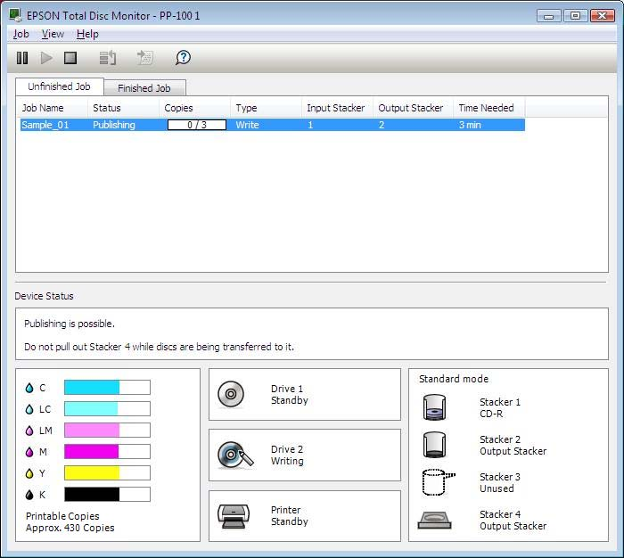

Job List

Operation
Guidance

Drive/Printer/
Stacker Status

Ink Cartridge 
Status

EPSON Total Disc Monitor provides the following information:

❏ Job List:
You can check a list of jobs (up to 1000 for Unfinished Job and 50 for Finished Job) and 
its information, and also you can cancel, pause, and restart unfinished jobs.

❏ Operation Guidance:
This provides device status information. It also displays error messages as well as 
helpful tips for better publishing. 

❏ Ink Cartridge Status:
This provides a graphic display of the ink cartridge status.

Note:
Printable copies is an approximate value based on the number of labels that can be printed 
from the present time when printing the same label as last time. This value may differ from the 
actual value as a result of influences such as the printing data and printing environment. Up to 
1000 is indicated as “1000 or more discs,” and less than 1000 is indicated in increments of 10.

❏ Drive, Printer, Stacker Status:
This provides a graphic display of the drives, printer, and stacker status. It also shows 
where an error occurs.

Troubleshooting
101

---

# Page 102

Disc or the Disc Tray Does Not Feed Correctly

Disc Does Not Feed

Remove the stack of discs and make sure of the following:

❏ The disc is not damaged.

❏ The disc is not too old. See the instructions that came with the disc for more 
information.

❏ The discs are not loaded above the red line in the stacker.

❏ Discs may have stuck together because of incorrect transportation of the discs; 
therefore, discs should be separated thoroughly before loading into the stacker. Also, 
storing discs in the stacker for an extended period of time may cause discs to stick to 
each other again. If discs are stored in the stacker for an extended period of time, 
separate the discs again before operating the product.

❏ A disc is not jammed inside the product. If it is, remove the jammed disc.
& See “Disc Jams” on page 103.

❏ The ink cartridges have not reached replacement time. If a cartridge has reached its 
replacement time, replace it.
& See “Replacing an Ink Cartridge” on page 80.

If a disc does not feed from the input stacker:

1. Open the disc cover.
2. Remove blank discs from the stacker.
3. Fan a stack of discs to prevent them from sticking together. 
4. Insert discs back in the stacker.
5. Close the disc cover.
6. Publish disc again.

If a disc does not feed from the drive tray or the printer tray:

1. Turn the power off.
2. Turn the power back on.
3. Publish disc again.

If the arm has picked up a disc:

Do not remove the disc by hand, as the arm may be damaged. To remove the disc, turn off 
the power and turn on the power again, and let the initializing process remove the disc.

Troubleshooting
102

---

# Page 103

If the same error continues to occur, contact your dealer.

Multiple Disc Feeds

❏ Make sure the disc stack fits under the red line in the stacker.

❏ Make sure none of the discs are damaged.

❏ Remove the stack of discs and make sure the discs are not too thin.
& See “Discs” on page 119.

❏ Remove discs from the stacker and fan them before loading them back.

❏ If only one disc is found when multiple feed error is displayed, disc thickness or 
warpage maybe out of standard. Follow the steps below to resolve the multiple disc 
feed error and replace discs. If the same error continues to occur, contact your dealer.

1. Open disc cover.
2. Remove the disc from the tray.
3. Remove discs from the input stacker.
4. Insert other discs into the input stacker.
5. Close the disc cover and the job will resume.

Disc Jams

If a disc is left in the drive or printer tray, it will be ejected when you turn off/on the product. 
If you cannot remove the disc by restarting the product, follow the procedures below:

❏ If a disc is stuck in the printer tray, turn off the product, unplug the power cable from the 
wall outlet, and open the disc cover located on the rear of the product. Then remove all 
the discs inside. Close the disc cover. After removing the discs, clean the printer tray.

❏ If a disc is stuck in the drive tray, turn off the product, unplug the power cable from the 
wall outlet, and then insert a pin into the eject hole to open the tray forcibly. Then, 
remove the disc from the tray and close it.

Note:
Insert a pin into the hole and push to eject the tray when the tray doesn’t unload by pressing the 
Eject button. In normal operation, the eject button should be used to unload the tray. Make sure 
the power of the product is turned off and wait more than one minute until disc rotation is 
stopped before accessing with the eject hole.

Note:
❏
If you cannot easily remove a foreign object, do not use force and do not disassemble the 
product. Call your dealer for assistance.

Troubleshooting
103

---

# Page 104

❏
If the arm is stopped while picking up disc, do not try removing disc by hand. This may result in 
damaging the arm. If such an error occurs, turn off/on the power and try resolving the problem 
by initializing the product. If the error continues to occur, contact customer support.

If your discs jam frequently, make sure of the following:

❏ The discs are smooth, not damaged.

❏ You are using high-quality discs.

❏ The printable sides of the discs are face up in the stacker.

❏ The stack of discs was fanned before loading.

❏ The stack of discs is not loaded above the dotted line in the stacker.

❏ The number of discs in the stacker does not exceed the limit specified for that disc.
& See “Mechanical” on page 126.

❏ The product is on a flat, stable surface that extends beyond the base in all directions. 
The product will not operate properly if it is tilted.

Writing Problem

Cannot Write to the Disc

Avoid using the product where dust or smoke is abundant. It may result in write error. 
If a disc write error occurs frequently, check the following:

❏ The disc is not damaged.

❏ The disc is high-quality.

❏ The product is used within acceptable environmental conditions.

❏ The product is not subject to vibration or shock.

❏ The fan filter is not clogged with dust.

❏ The printer tray is not dirty.

Troubleshooting
104

---

# Page 105

Print Quality Problems

If you are having a print quality problem, then compare it with the illustrations below. Click 
the caption under the illustration that best resembles your printout.

Good sample
Good sample

“Horizontal Banding” on page 105
“Vertical Misalignment” on page 
106

“Horizontal Banding” on page 105
“Vertical Misalignment” on page 
106

“Incorrect or Missing Colors” on 
page 106
“Blurry or Smeared Printout” on 
page 107

Horizontal Banding

❏ Make sure the printable side of the disc is face up in the stacker.

Troubleshooting
105

---

# Page 106

❏ Run the head cleaning utility to clear any clogged ink nozzles.
& See “Cleaning the Print Head” on page 85.

❏ Use ink cartridges within six months after opening the packages.

❏ Use genuine Epson ink cartridges.

❏ Check the H Ink light. If the light is on, replace the appropriate ink cartridge.
& See “Replacing an Ink Cartridge” on page 80.

❏ Make sure the label type selected in the printer driver is appropriate for the type of disc 
loaded in the product.
& See “Publishing Discs” on page 24.

Vertical Misalignment

❏ Run the print head alignment utility.
& See “Aligning the Print Head” on page 87.

❏ Make sure the label type selected in the printer driver is appropriate for the type of disc 
loaded in the product.
& See “Publishing Discs” on page 24.

Banding

❏ Make sure the printable side of the disc is face up in the stacker.

❏ Run the head cleaning utility to clear any clogged ink nozzles.
& See “Cleaning the Print Head” on page 85.

❏ Make sure the label type selected in the printer driver is appropriate for the type of disc 
loaded in the product.
& See “Publishing Discs” on page 24.

❏ Due to the variation in the quality of discs, print results using the same type of discs 
from the same data may not be the same.

Incorrect or Missing Colors

❏ Adjust the color settings in your application or in your printer driver settings.
Check the Main window. 
See the printer driver online Help for details.

Troubleshooting
106

---

# Page 107

❏ Run the head cleaning utility.
& See “Cleaning the Print Head” on page 85.

❏ Check the H Ink light. If the light is on, replace the appropriate ink cartridge.
& See “Replacing an Ink Cartridge” on page 80.

❏ If you have just replaced an ink cartridge, make sure the date on the box has not 
expired. If you have not used the product for a long time, replace the ink cartridges.
& See “Replacing an Ink Cartridge” on page 80.

Blurry or Smeared Printout

❏ Use genuine Epson ink cartridges.

❏ Make sure the product is on a flat, stable surface that extends beyond the base in all 
directions. The product will not operate properly if it is tilted.

❏ Make sure your disc is not damaged, dirty, or too old.

❏ Make sure your disc is dry and the printable side is facing up.

❏ Make sure the label type selected in the printer driver is appropriate for the type of disc 
loaded in the product.
& See “Publishing Discs” on page 24.

❏ Do not touch or allow anything to come into contact with the printed side of a disc with 
a shiny finish. After printing on a glossy disc, allow the ink to set for a few hours before 
handling it.

❏ Run the head cleaning utility.
& See “Cleaning the Print Head” on page 85.

Miscellaneous Printout Problems

Incorrect or Garbled Characters

❏ Clear any stalled print jobs from the Windows Spooler.

❏ Turn off the product and computer. Make sure the product’s interface cable is securely 
plugged in.

❏ Uninstall the printer driver, then reinstall it.
& See “Uninstalling Software” on page 23.

Troubleshooting
107

---

# Page 108

Incorrect Margins

❏ Check the Inner/Outer Diameter settings in your application. Make sure the margins are 
within the printable area of the disc.
& See “Printable area” on page 122.

❏ Make sure the printer driver settings are appropriate for the label size you are using.
Check the Main window.
See the printer driver online Help for details.

❏ Uninstall the printer driver, then reinstall it.
& See “Uninstalling Software” on page 23.

❏ The printing location may shift depending on the disc used. Perform print head 
alignment or correcting the printing position.
& See “Correcting the Printing Position” on page 88.

❏ The ink receptor layer may shift from the center of the disc, making the print location 
appear shifted from the ink receptor layer. Check if the ink receptor layer is shifted from 
the center of the disc or from the outer edge.

Printout Has a Slight Slant

❏ Run nozzle check, print head cleaning, and print head alignment utilities.

Printed Side is Smeared or Scuffed

❏ Select the appropriate disc size setting in the printer driver.

❏ Uninstall the printer driver, then reinstall it.
& See “Uninstalling Software” on page 23.

Printing is too Slow

❏ Make sure the label type selected in the printer driver is appropriate for the type of disc 
loaded in the product.
& See “Publishing Discs” on page 24.

❏ Close any unnecessary applications.

❏ Make sure the checkbox for High Speed is checked in the printer driver.

Troubleshooting
108

---

# Page 109

❏ If you print continuously for an extended period, the discs may temporarily stop feeding 
or the printing may pause for a while. This is to slow down the printing speed and 
prevent the product mechanism from overheating and being damaged. If this happens, 
you can continue to print, but we recommend stopping and leaving the product for about 
thirty minutes with the power on. (The product will recover after about 3 hours with the 
power off.) After you restart, the product will print at normal speed.

❏ Uninstall the printer driver, then reinstall it.
& See “Uninstalling Software” on page 23.

Ink Adheres to the Recording Surface

❏ Depending on the type of disc, ink may adhere to the recording surfaces if they are 
stacked right after printing. Make sure of the type of disc before using.

❏ Keep the printed surface of the disc away from other discs until ink on the printed disc 
is completely dry, otherwise marks or smudges may be left at the area where discs 
come into contact.

The Product Does Not Function

All Lights Are Off

❏ Press the P Power button to make sure the product is on.

❏ Turn off the product, and make sure the power cord is securely plugged in.

❏ Make sure your outlet works and is not controlled by a wall switch or timer.

Lights Came On and then Went Out

The product’s voltage may not match the outlet rating. Turn off the product and unplug it 
immediately. Then check the label on the back of the product.
c
Caution:
If the voltage does not match, DO NOT PLUG YOUR PRODUCT BACK IN. Contact your 
dealer.

Troubleshooting
109

---

# Page 110

Only the Power Light is On

❏ If you press the P Power button lightly, the product may not turn on, although the 
 
Power light flashes for a while. Press the button firmly.

❏ Turn off the product and computer. Make sure the product’s interface cable is securely 
plugged in.

❏ If you are trying to print a large image, your computer may not have enough memory. 
Try reducing the resolution of your image or printing the image at a smaller size. You 
may need to install more memory in your computer.

❏ Uninstall the printer driver, then reinstall it.
& See “Uninstalling Software” on page 23.

The Ink Light is Flashing or is On after you Replace the Cartridge

Make sure the ink cartridge is correctly installed.

Software Cannot be Installed

❏ Is the USB cable unplugged? Make sure the USB cable is firmly connected.

❏ Does the USB cable match the computer and the product requirements? The USB 
cable used to connect the computer and the product should be USB 2.0 compatible.

❏ Does the HDD have sufficient free space? The software cannot be installed if the HDD 
does not have sufficient free space.
& See “System Requirements” on page 15.

❏ Did you log on as a user with administrator privileges (belonging to the administrator 
group) for Windows? When installing the software, log on as a user with administrator 
privileges (belonging to the administrator group).

❏ Are you using a USB hub? The USB cable should be connected directly between the 
PC and the product.

❏ Is Windows Media Player installed? Windows Media Player must be installed before 
installing the Total Disc Maker.

❏ The output device may not be recognized in an environment with Windows Media 
Player 7 installed. In this case, uninstall EPSON Total Disc Maker and restart the 
computer, then reinstall EPSON Total Disc Maker.

Troubleshooting
110

---

# Page 111

❏ If the language setting of the system is different from the user, installation may not be 
correctly performed. Make sure to set the language setting of the system and the user 
the same before installation.

When installing the software, make sure to turn the product off; then start installation. 

Ink Pad Nearly Full Message is Displayed by the Software

Ink pad is nearly full. Please have an authorized Epson service center replace the ink pad 
right away. The pad is nearly full, and the unit will stop functioning when the pad becomes 
full. Do not attempt to service the unit yourself.

Disc Cannot be Published

If the user is logged on as a guest and could not access the service; terminal service must 
be enabled before publishing (except for Windows 7 or Windows Vista). Contact 
administrator for terminal service settings.

Disc Information Cannot be Read

If "The disc information cannot be read. You must be logged on with administrator 
privileges." message is displayed, log onto Windows with administrator privileges.

If you are copying from a drive, log onto Windows with administrator privileges first.

DVD Drive of the Product is not Displayed when You Click "Safely 
Remove Hardware" Icon

Under the Windows Vista environment, the DVD drive of the product will not be displayed 
when you click the "Safely Remove Hardware" icon. Please disconnect or turn off the 
product after computer is turned off.

Troubleshooting
111

---

# Page 112

Appendix A 
Where To Get Help

Contacting Customer Support

Before Contacting Epson

If your Epson product is not operating properly and you cannot solve the problem using the 
troubleshooting information in your product documentation, contact customer support 
services for assistance. If customer support for your area is not listed below, contact the 
dealer where you purchased your product.

Customer support will be able to help you much more quickly if you give them the following 
information:

❏ Product serial number
(The serial number label is usually on the back of the product.)

❏ Product model

❏ Product software version
(Click About, Version Info, or similar button in the product software.)

❏ Brand and model of your computer

❏ Your computer operating system name and version

❏ Names and versions of the software applications you normally use with your product

Help for Users in the United States and Canada

Contacts for information, support, and services are:

Discproducer Technical Support: 562-276-1360

Location: Epson America Inc.

Web site URL: http://www.epsonexpert.com

This site will provide the end user with access to the latest drivers and FAQs.

Where To Get Help
112

---

# Page 113

Help for Users in the Europe (EMEA)

Contacts for information, support, and services are:

Web site URL: http://www.epson-europe.com

Or contact your local distributor or Epson sales company.

If you need the latest drivers, FAQs, manuals, or other downloadable, access the site at:

http://download.epson-biz.com/?service=dp

Help for Users in Australia

Contacts for information, support, and services are:

Epson Australia Pty Ltd
3 Talavera Road
North Ryde NSW 2113
Australia

Phone: 02-8899-3666
Fax: 02-8899-3777

If you need the latest drivers, FAQs, manuals, or other downloadable, access the site at:

http://www.epson.com.au

Help for User’s in Southeast Asia

Contacts for information, support, and services are:

PT. Epson Indonesia
Wisma Kyoei Prince, 16th Floor
Jl. Jend Sudirman Kav. 3
Jakarta 10220 Indonesia
Tel: 021 572 3161
Fax: 021 572 4357
Helpdesk: 0807 11 37766
www.epson.co.id

Where To Get Help
113

---

# Page 114

Epson Singapore Pte Ltd
1 HarbourFront Place
#03-02 HarbourFront Tower 1
Singapore 098633
Helpdesk: 6586 3111
www.epson.com.sg

Epson Malaysia Sdn Bhd
3rd Floor, East Tower,
Wisma Consplant 1,
No.2 Jalan SS 16/4,
47500 Subang Jaya, Selangor DE,
Malaysia
Tel: 03-5628 8288
Fax: 03-5621 2088
Helpdesk: 03-5521 5888
www.epson.com.my

Epson (Thailand) CO., Ltd.
195 Empire Tower 42nd Floor,
South Sathorn Road Yannawa
Sathorn, Bangkok 10120
Thailand,
Tel: 0-2685-9888
Fax: 0-2685-9889
Helpdesk: 0-2685-9899
www.epson.co.th

Epson Philippines Corporation
8th Floor, Anson's Centre
#23 ADB Avenue,
Pasig City 1605, Philippines
Trunkline: 63-2 706-2609
Customer Care:
Trunkline: 63-2 706-2609 (Press 2)
Fax: 63-2 706-2663
Toll-Free No.: 1-800-1068-EPSON (37766)
www.epson.com.ph

Where To Get Help
114

---

# Page 115

Appendix B 
Product Information

Product Parts and Control Panel Functions

Product Parts

a
b

c
d

a. Ink cartridge cover: Secures the ink cartridges. Open only when installing or replacing ink 
cartridges.

b.
Control panel: Use the button and monitor the lights to control your product. See the next 
section for details.

c.
Disc cover: Open when loading or taking out the discs.

d. Power button: Turns the product on or off.

Product Information
115

---

# Page 116

e
f g
h

i

e.
AC inlet: Plug in the power cord.

f.
USB connector: Connects a USB cable from your computer to the product. 

g.
Interface cable locking saddle: Use this for directing and gathering the cable.

h.
Air vent: Leave at least 10 cm (3.94") between the back of the product and the wall for 
ventilation.

i.
Rear printer cover: Open this cover only when a disc is stuck in the printer tray.

c
Caution:
Before opening the rear printer cover, be sure to unplug the power cable from the wall outlet. 
Be sure to attach this cover while in use.

Product Information
116

---

# Page 117

j
k l

r

q

m
p o
n

j.
Drive 1: Writes data on the recording surface of discs.

k.
Arm: Transports discs.

l.
Stacker 1: Use stacker 1 as a disc input stacker. Holds up to 50 discs.

m. Stacker 2: Use stacker 2 as a disc input or output stacker. Holds up to about 50 discs.

n.
Lock lever: Use this lever to lock or unlock stacker 4. Lock the lever when you use stacker 3.

o.
Stacker 3: Use stacker 3 as a disc output stacker. Holds up to about 50 discs.

p. Stacker 4: Use stacker 4 as a disc output stacker. Holds up to about 5 discs.

q.
Printer: Prints on label surface of discs.

r.
Drive 2: Writes data on the recording surface of discs.

Product Information
117

---

# Page 118

Control Panel

Buttons

Button 
Function

Press and hold for 3 seconds to clean the print head.

Cleaning

Lights

Light 
Description

On when the product is on.

Flashes when the product is initializing, after replacing an ink cartridge, 
charging ink, or cleaning the print head.

Power

Flashes when jobs are processed.

On when cover is open, or when errors on disc transfer, stacker, drive, or 
printer occur.

Flashes when a problem occurs with the product.

On when an ink cartridge has reached its replacement time or is not 
correctly inserted.

Flashes when ink is low.

INK

On when the stacker is overloaded with discs, or when stacker 3 is not 
removed while stacker 3 is set to Do not use in Standard mode and 
External Output mode. 

Flashes when the stacker is not installed correctly or the stacker is out of 
discs.

STACKER

When the stacker 4 light flashes rapidly, do not pull out stacker 4.

For details on error status, see the following instructions.
& See “Error Indicators” on page 93.

Product Information
118

---

# Page 119

Ink and Disc

Ink Cartridges

You can use the following ink cartridges with this product:

Ink cartridge
Product name
Part number

Cyan
PJIC1(C)
C13S020447

Light Cyan
PJIC2(LC)
C13S020448

Light Magenta
PJIC3(LM)
C13S020449

Magenta
PJIC4(M)
C13S020450

Yellow
PJIC5(Y)
C13S020451

Black
PJIC6(K)
C13S020452

To purchase a Discproducer series exclusive ink cartridge, check with the dealer where 
you purchased your product or access either of the following urls:

http://www.epson-europe.com (Europe)
http://www.discproducer.epson.com (United States and Canada)

Discs

Epson offers the specified CD-R and DVD-R discs for all your writing and printing needs.

Product Information
119

---

# Page 120

Technical Specifications

Discs
c
Caution:
Writable/printable discs are 12 cm (4.72”) CD/DVD discs. The 80 mm (3.15”) discs are not 
supported.

Note:
❏
Since the quality of any particular brand or type of disc may be changed by the manufacturer at 
any time, Epson cannot attest to the quality of any brand or type of disc. Always test samples 
of disc stock before purchasing large quantities or printing large jobs.

❏
Poor quality discs may reduce print quality and cause disc jams or other problems. If you 
encounter problems, switch to a higher grade of disc.

❏
The specified disc is for ink jet printers.

❏
The specified disc has a moisture adhesive ink receptor layer on the label surface. If stored 
stacked, especially under high humidity and high temperature conditions, discs may adhere to 
each other. If an automatic duplication machine is used, please check the disc before using.

❏
Please treat the recording surface (blue green colored side) and printing surface carefully so 
they do not have fingerprints, dirt, dust, water, or scratches. Dust and dirt on the recording 
surface should be wiped gently with soft dry cloth, commercially available disc cleaner, or ethyl 
alcohol. Do not use benzine, thinner, or antistatic material.

CD/DVD:

Type
CD-R/DVD-R 4.7GB/DVD+R 4.7GB/DVD-R DL 8.5GB/DVD+R 
DL 8.5GB

Label side
Printable
Glossy labels other than the specified disc type are not 
supported.

Specified disc
CD-R, DVD-R

Notes for handling discs

Notes when using discs

❏ Do not touch recording surface when holding it. 

❏ Handle with care so that label surface and recording surface do not have fingerprints, 
dirt, dust, water drops, or scratches.

Product Information
120

---

# Page 121

❏ Do not drop or hit discs.

❏ Do not apply excess force, like pinching with a clip, or bend.

❏ Do not attach an adhesive sticker to the disc. This may result in the disc being unable 
to record or play.

❏ Do not use in a place where lots of dirt and dust are present.

❏ If write and print are performed separately, it is recommended to write before printing.

❏ Leaving discs stacked may result in discs sticking to each other.

❏ Let the discs dry naturally after printing. Touching the surface with your hand or 
splashing the surface with water right after printing may result in blurriness and 
stickiness.

❏ Printing is possible only on the printing surface. When printing by hand, use a 
soft-tipped writing instrument like a felt pen, and do not use a ballpoint pen. Also, do not 
erase once printed.

❏ Do not use with an auto loading mechanism, a drive with a holding mechanism larger 
than 33 mm, or an automotive drive. Depending on the condition used, the printing 
surfaces may stick.

❏ A published CD/DVD may not be readable on another type of drive or player due to 
compatibility.

❏ The recording surface side has a concentric ring projection called the stack ring. 
Depending on the disc, projection of the stack ring is small and use of such a disc may 
cause the disc to stick before or after printing. It is recommended to check the disc 
before use. 

❏ The specified discs have a moisture-adhesive ink receptor layer on the label surface. If 
stored stacked, especially under high humidity and high temperature conditions, discs 
may adhere to each other. If an automatic duplication machine is used, please check 
the disc before using.

Notes when storing discs

❏ Do not store in direct sunlight, near heating equipment, or high humidity and 
temperature. 

❏ Do not place where large temperature variance takes place, as condensation may 
occur.

❏ Do not place an object on top of the disc. 

Product Information
121

---

# Page 122

❏ When storing, keep the disc in its disc case, and avoid letting film or cards touch the 
printing surface. These may scratch the printing surface.

❏ Do not store discs in soft cases or bags which may touch the printing surface directly. 
This may cause discs to stick; may cause color shading or discoloration.

❏ Avoid storing with part of the printing surface covered, as this may cause smearing or 
discoloration.

❏ Making a backup is recommended if the data is important. It is recommended to make 
backups periodically if storing for long period of time.

❏ Avoid storing in high temperatures and high humidity, which may result in blurriness 
and stickiness of the printing surface.

Printable area

The printable area is the area available for label printing.
The printable area can be set from the Set Inner/Outer Diameter screen of EPSON Total 
Disc Maker.
In the Set Inner/Outer Diameter screen, you can select Standard, Wide, or set manually.
The following diagram shows the printable area for Standard and Wide. Printing will be 
done in the gray area.

CD/DVD:

12-cm (4.72") CD/DVD (Standard)
12-cm (4.72") CD/DVD (Wide)

45 mm

25.5 mm

116 mm

116 mm

Inner diameter
Outer diameter
Inner diameter
Outer diameter

45 mm (1.77")
116 mm (4.57")
25.5 mm (1.00")
116 mm (4.57")

Product Information
122

---

# Page 123

c
Caution:
❏
Make sure to set the inner diameter and the outer diameter within the areas shown above. 
Printing on sections outside the printable area may damage your CD/DVD drive.

❏
The EPSON Total Disc Maker can set between an inner diameter of 18 mm and an outer 
diameter of 119.4 mm (0.71 to 4.70"). However, printing outside the printable area (45 to 
116 mm) may result in sticking, staining of the disc tray, peeling of print, and blurring of 
print. It is recommended to check the disc type before using.

❏
When printing outside the printable area (ink absorbing layer) of the disc occurs, the ink 
printed outside the printable area does not fix. Check the label of the printable area of the 
disc being used before setting.

❏
Precautions for setting the printable area
-Make sure the printable area set does not exceed the printable area of the actual disc 
being used.
-Check whether coloration of print made on the rib (stack ring) is not uniform.
-Printing on the rib (stack ring) may cause ink sticking, disc sticking, and ink erasure after 
printing.

❏
Measures to be taken when printing outside printable area:
When printing inside the inner diameter results in ink sticking, disc sticking, and ink 
erasure, take the following action to avoid that.
-Set Drying Time on the printer driver’s printer settings screen and print. Although 
throughput may be reduced, problems will be avoided or reduced, since the disc will be 
ejected after a set time.
-Enable Publish after Mask Rib Area. If you print from another application, set from the 
user-defined label setting in the printer driver. If you print from the Total Disc Maker, set 
from Set Inner/Outer Diameter setting.

Note:
When you print on CDs/DVDs with a commercially available software package that supports 
CD/DVD printing, you have to make the following settings.

Size
124 x 124 mm (4.88 x 4.88")

Type
CD/DVD Label, CD/DVD Premium Label, or Epson Specified 
CD/DVD Label

Margins on all sides
2 mm (0.08")

Ink Cartridges

Color
Black, Yellow, Magenta, Light Magenta, Cyan, Light Cyan

Cartridge life
Use within 6 months of opening the package.

Temperature
Storage:
-20 to 40 °C (-4 to 104 °F) 

1 month at 40 °C (104 °F)

Product Information
123

---

# Page 124

c
Caution:
❏
Epson recommends the use of genuine Epson ink cartridges. Other products not 
manufactured by Epson may cause damage that is not covered by Epson’s warranties, 
and under certain circumstances, may cause erratic behavior.

❏
Use the ink cartridge before the expiration date printed on its package.

❏
Do not refill the ink cartridge. Other products not manufactured by Epson may cause 
damage that is not covered by Epson's warranties, and under certain circumstances, may 
cause erratic behavior.

Note:
❏
The ink cartridges packaged with your product are partly used during initial setup. In order to 
produce high-quality printouts, the print head in your product will be fully charged with ink. This 
one-off process consumes a quantity of ink, and therefore these cartridges print fewer pages 
compared to subsequent ink cartridges.

❏
Do not store ink cartridges in high or freezing temperatures, or in direct sunlight.

❏
To ensure that you receive premium print quality and to help protect your print head, a variable 
ink safety reserve remains in the cartridge when your product indicates to replace the cartridge. 
The yields quoted for you do not include this reserve.

❏
Cartridge yields vary considerably based on images printed, print settings, disc type, frequency 
of use, and temperature. For print quality, a variable amount of ink remains in the cartridge after 
the "replace cartridge" indicator comes on. This product ships with full cartridges and part of the 
ink from the first cartridges is used for priming its printer. See www.discproducer.epson.com for 
more information about cartridges.

❏
Even when Black is selected, all the ink colors are used in an operation designed to maintain 
the printing and print head quality.

Product Information
124

---

# Page 125

Job Processing

Job 
processing 
speed

Write and print
CD
30 discs/hr

When using EPSON specified CD-R, 
drive speed of 40x, writing 600 MB 
data, and Speed/Bidirectional printing.

DVD
15 discs/hr

When using EPSON specified DVD-R, 
drive speed of 12x, writing 3.8 GB data, 
and Speed/Bidirectional printing.

Print only
Quality/Speed: [2]
60 discs/hr

Bidirectional printing

Quality/Speed: [1]
40 discs/hr

Bidirectional printing

Printing direction
Bidirectional, unidirectional

Note:
❏
Depending on the disc or the computer used, writing speed may become slower than the set 
speed.

❏
Above figures are based on Windows XP.

Number of Products that can be Connected to One Computer

Number of products that can 
be connected to one 
computer*1

Write and print
CD
3

DVD
1

Print only
6

*1 Guaranteed number of products that can process jobs published from one connected PC at the same time.

Printing

Printing method
On demand inkjet

Head
Number of nozzles
180 per color

Resolution
Print Mode Setting 
(Quality/Speed)
[1]: 1,440 x 1,440 dpi

[2]: 1,440 x 720 dpi

dpi: number of dots every 25.4 mm (dots per inch)

Product Information
125

---

# Page 126

Write Speed

CD-R
40x / 32x / 24x /16x / 10x / 4x

DVD-R 
12x / 8x / 6x / 4x / 2.4x / 2x

DVD+R 
12x / 8x / 6x / 4x / 2.4x / 2x

DVD-R DL
8x / 6x / 4x / 2.4x / 2x

DVD+R DL
8x / 6x / 4x / 2.4x / 2x

Note:
If you select 2.4x for DVD-R/DVD-R DL, write speed will be set to 2x.
If you select 2x for DVD+R/DVD+R DL, write speed will be set to 2.4x.

Mechanical

Drive
Two drives, tray loading type

Stacker capacity
Stacker 1 to 3: Max. about 50 discs

Stacker 4: Max. about 5 discs

Dimensions
Width: 377 mm (14.8 inches)

Depth: 465 mm (18.3 inches)

Height: 348 mm (13.7 inches)

Weight
Approx. 24 kg (53 lb) with accessories (excluding AC cable)

Electrical

Input voltage range
AC 100 to 240 V

Rated frequency range
50 to 60 Hz

Rated current
1.0 A

Power consumption
Operating
Approx. 41 W

Standby mode
Approx. 24 W

Note:
Check the label on the back of the product for its voltage.

Product Information
126

---

# Page 127

Environmental

Temperature
Operation:
10 to 35 °C (50 to 95 °F)

Storage: 
-20 to 40 °C (-4 to 104 °F)

1 month at 40 °C (104 °F)

Humidity
Operation:*1 
20 to 80% RH

Storage:*1

5 to 85% RH

*1 Without condensation

Standards and Approvals

Safety
UL60950-1
CAN/CSA-C22.2 No.60950-1

EMC
FCC Part 15 Subpart B Class B 
CAN/CSA-CEI/IEC CISPR 22 Class B
AS/NZS CISPR22 Class B

Low voltage directive 2006/95/EC
EN60950-1

EMC directive 2004/108/EC
EN55022 Class A 
EN61000-3-2 
EN61000-3-3
EN55024

GOST-R
IEC60950-1
CISPR Pub. 22

Interface

Compliance
USB 2.0

Communication speed
Hi-Speed (480 Mbps)

Full-Speed (12 Mbps)

Product Information
127

---

# Page 128

Lifetime

Ink pad life: About 30,000 discs printed

The ink pad is estimated to need replacing after about 30,000 discs. Based on printing 
2,000 discs per month, bidirectional. Actual results will vary based on such factors as 
images printed, print settings, media type, frequency of use, and temperature.

Product Information
128

---

